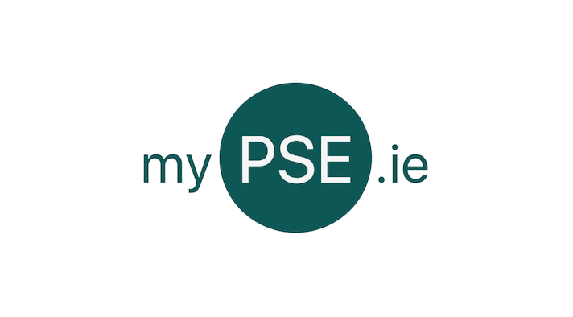
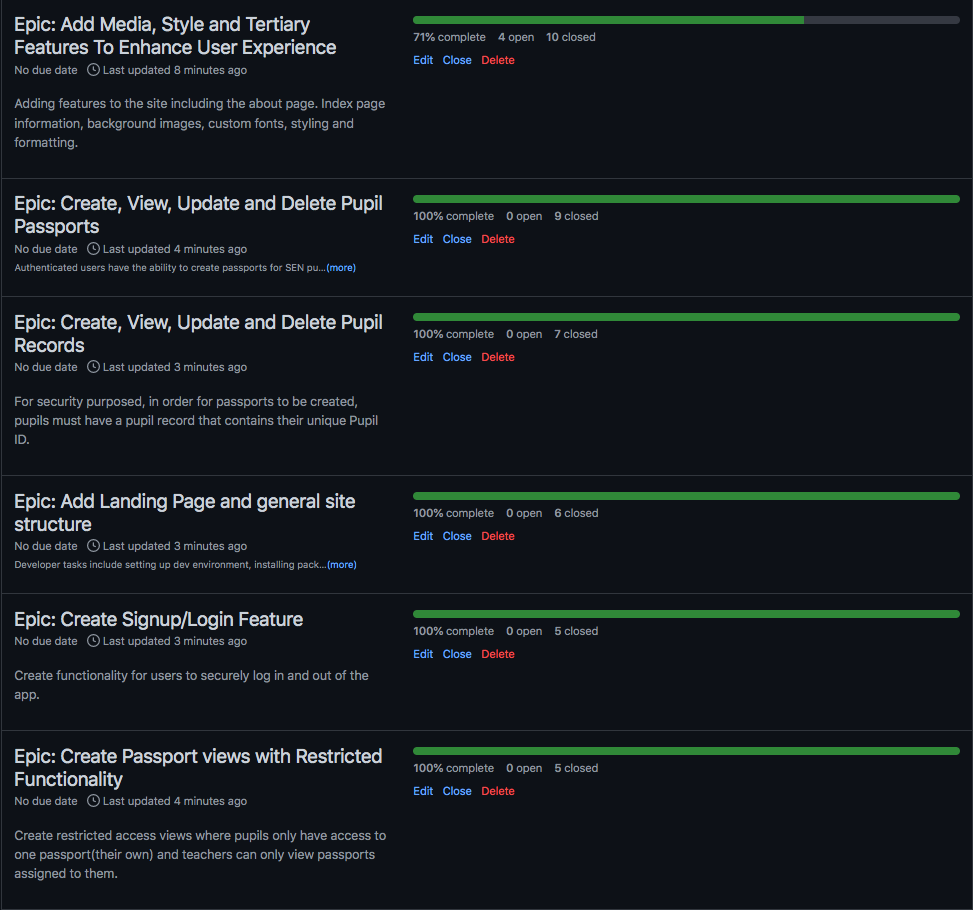
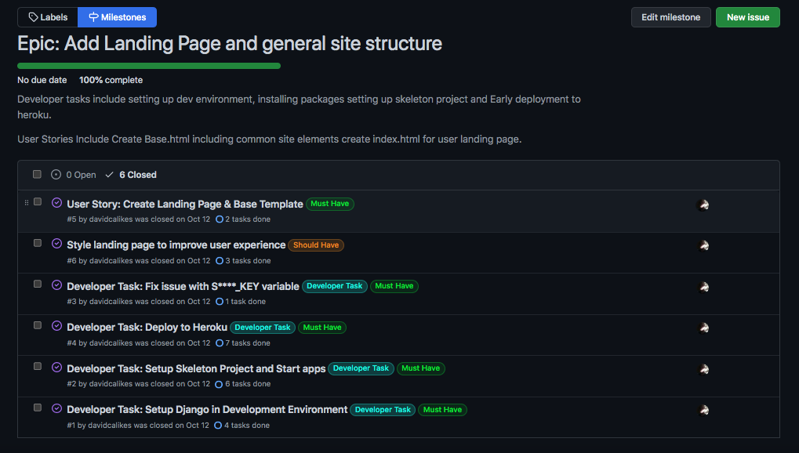
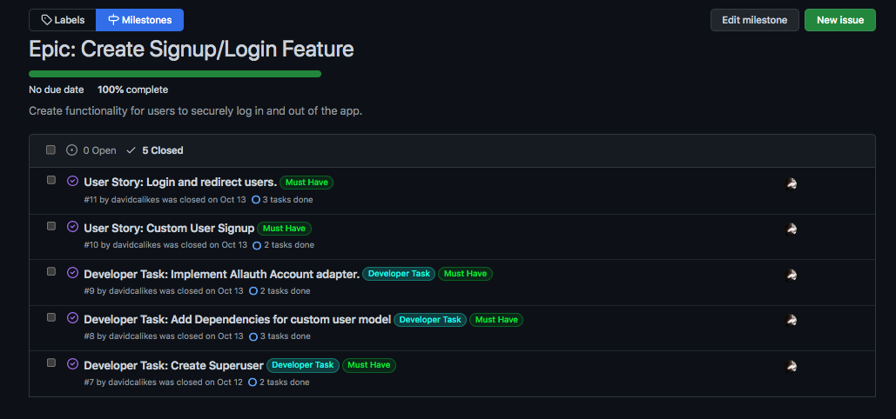
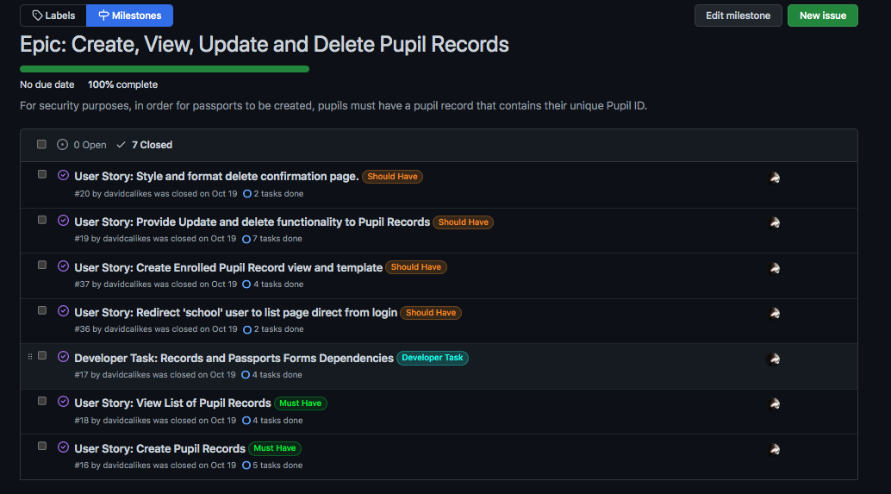
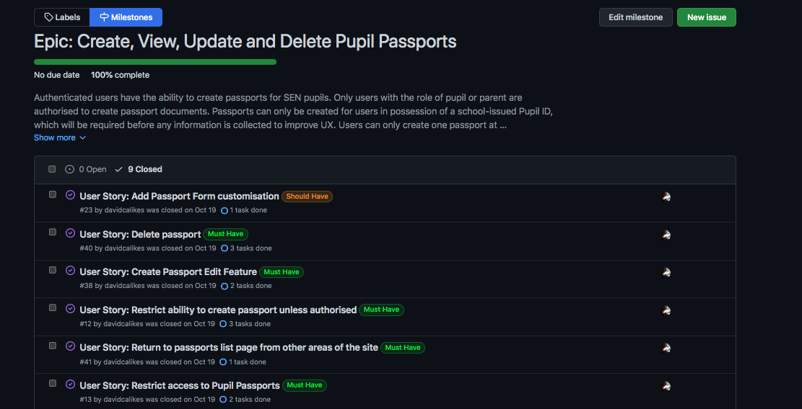
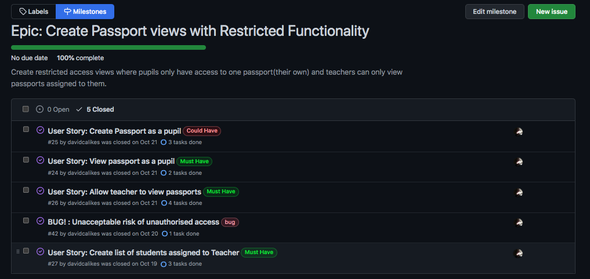
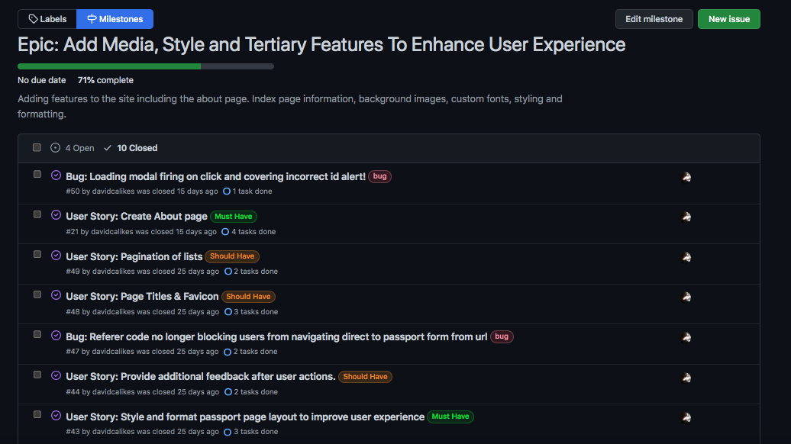
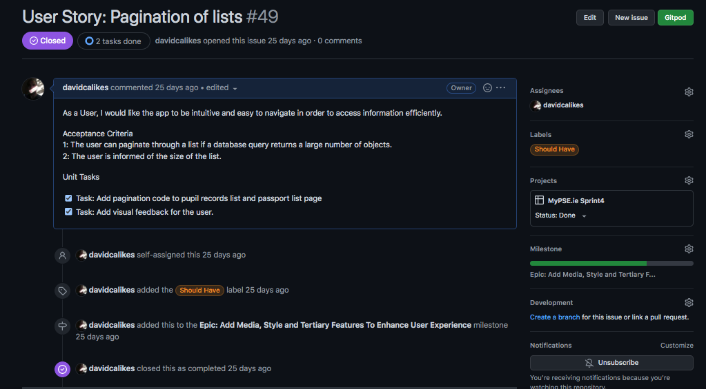
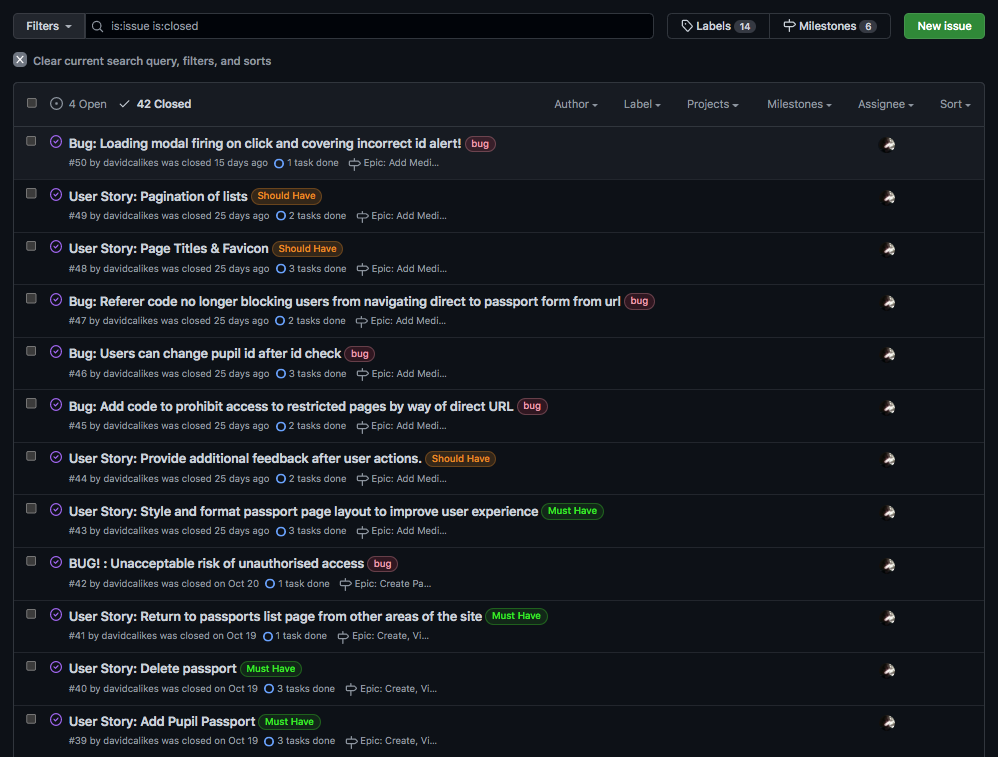

# Agile

## Overview

I utilised the Agile planning methodology during the development of MyPSE.ie.   

 

This was my first experience approaching a project using Agile and I encountered many challenges along the way.

 

Before this project, I had successfully developed other applications using the traditional, 'Waterfall' method, which is a more direct, individualised, approach to project management.

Initially, I struggled to adapt to the new methodology and found utilising what is fundamentally considered a collaborative, cyclical, approach confusing, as I tried to organise and plan as an individual developer.

As a result of this confusion I made a lot of planning errors while developing my KANBAN boards, Epics, and Issue Cards. 

For example, when I began creating my KANBAN boards, I had already organised most of the development environment and installed some of the project dependencies before I realised I should have included that work as part of the Agile process, breaking down each developer task into individual increments of work. 

It is however, one of the priciples of Agile to "respond to change rather than stick to a plan" so I resolved the issues and adapted my approach by reorganising the layout of my boards and cards accordingly.

I also initially felt that my Epics could have been better organised and that I had too may user stories per Epic, but in retrospect the project was completed successfully and they served their purpose in providing me an overview of the relationships between smaller units of work.

 

 

## Benefits of the Agile approach

 

As I moved through the initial stages of the project, I began to recognise the real benefits of Agile.

 

An example of this is in the image presented above. In the 'In Progress' section of the Sprint 1 board, user story #35 is concerned with styling at the front end of the project while other user stories and developer tasks are focused on the back end.

It is easy to imagine how multiple developers pulling, branching and working on these issues at the same time can rapidly produce impressive and satisfying results and how being able to view such progress would be good for team morale.

Even though I was working through the project alone, I felt like I was making progress through the project at the end of each cycle. 

Using agile also helped me focus on one task at a time and I genuinely believe the project benefitted overall from using this methodology.

 

## MoSCoW

When utilising MoSCow prioritisation I felt I had a good mix of 'Would Have', 'Could Have', 'Should Have' and 'Wont Have This Time' cards. I realise now however that I had far too many must have labels and it is something I will be wary of when prioritising work units in future projects.

 

## Epics

Six Epics in total were created for referance during the agile process and used GitHub 'Milestones' to link the 'User Stories' derived from each Epic.

 

The six Epics were:

1. [Add Landing page and general site structure](https://github.com/davidcalikes/mypse.ie/milestone/1?closed=1)

Developer tasks include setting up dev environment, installing packages setting up skeleton project and Early deployment to heroku.

User stories include: "Create Base.html including common site elements" and "Create index.html for user landing page"

 

2. [Create Signup/Login Feature](https://github.com/davidcalikes/mypse.ie/milestone/2?closed=1)

Create functionality for users to securely log in and out of the app.

User stories include: "Create Superuser", "Implement Allauth Adapter" and "Login and redirect users"

 

3. [Create, View, Update and Delete Pupil Records](https://github.com/davidcalikes/mypse.ie/milestone/4?closed=1)

For security purposes, in order for passports to be created, pupils must have a pupil record that contains their unique Pupil ID.

User stories include: "View List of Pupil Records", "Create Enrolled Pupil Record view and template" and "Style and format the delete pupil record conformation page"

 

4. [Create, View, Update and Delete Pupil Passports](https://github.com/davidcalikes/mypse.ie/milestone/3?closed=1)

Authenticated users have the ability to create passports for SEN pupils. 

Only users with the role of pupil or parent are authorised to create passport documents. Passports can only be created for users in possession of a school-issued Pupil ID, which will be required before any information is collected to improve UX. Users can only create one passport at a time. If a passport already exists for a pupil, users cannot create a new passport without deleting the old one first.

User stories include: "Create Passport", "Create Passport List" and "Add Passport Form Customisation"

 

5. [Create Passport views with Restricted Functionality](https://github.com/davidcalikes/mypse.ie/milestone/6?closed=1)

Create restricted access views where pupils only have access to one passport(their own) and teachers can only view passports assigned to them.

User stories include: "Create a list of pupils assigned to a teacher" and "Create a Passport as a Pupil"

 

6. [Add Media, Style and Tertiary Features To Enhance User Experience](https://github.com/davidcalikes/mypse.ie/milestone/5?closed=1)

Adding features to the site including the about page. Index page information, background images, custom fonts, styling and formatting.

User stories include: "Style and format base template to improve user experience" and Style and format passport page layout to improve user experience"

 

## Agile User Stories

 

The User Stories created for referance within the Agile framework were derived from both the Epics created and also the empathetic User Stories I created as a result of planning research during the 'User Experience Design' phase of the project. I used GitHub Issues to create cards for Agile User Stories, Development Tasks and Bugs.

The structure of a MyPSE.ie Agile User Story can be seen below.

_Agile User Story_

As evidenced above, the title of Each Agile User Story can be more accurately thought of as a descriptive overview of the tasks within the Issue. The actual User Story this issue will address is written at the top part of each Issue Card.

Each Issue Card contains:

* A Title: Descriptive overview of the issue/ticket

* The User Story the issue addresses

* Acceptance Criteria for each issue/ticket

* Tasks required to satisfy the acceptance criteria

* A label that determines the importance of each Issue

* An assigned Kanban board

* An assigned Epic

 

Due to my inexperience working with Agile I made errors when creating some of the user stories and had to removed some issues during development due to overlap. The final amount of issues created totalled 44, of which 29  Agile user stories were created, 5 were bugs that I added during development and the remainder (7) were added as Developer Tasks.

_Agile Issues_

The full list of issues for the project is available [here](https://github.com/davidcalikes/mypse.ie/issues?q=is%3Aissue+is%3Aclosed)

## Sprints

### Timeboxing
Due to my inexperience working with the Agile methodology and with Django as a development framework 

