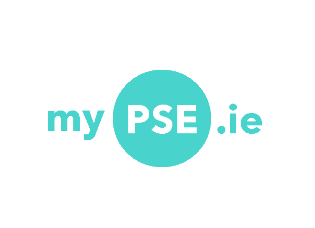
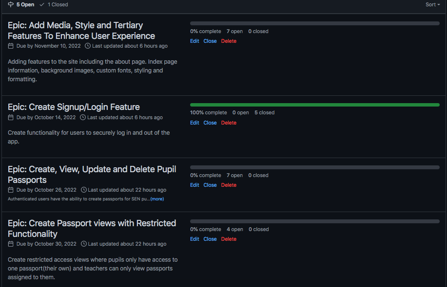
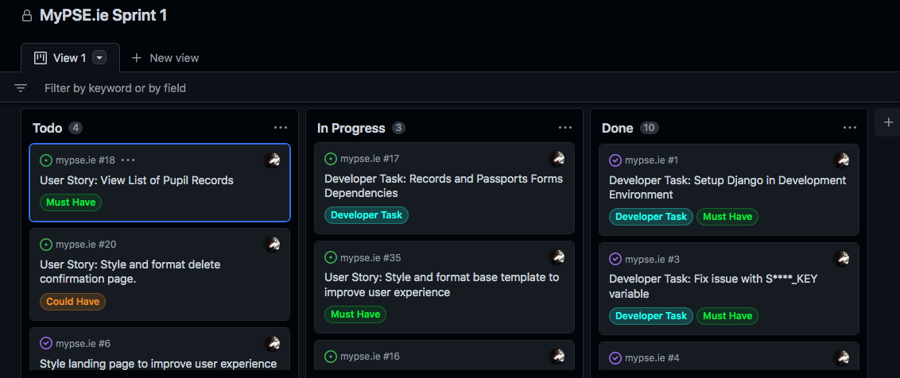
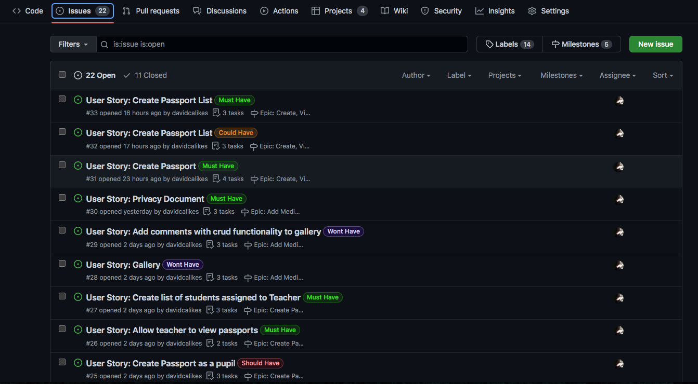

# Agile

## Overview

I utilised the Agile planning methodology during the development of MyPSE.ie.   

 

This was my first experience approaching a project using Agile and I encountered many challenges along the way.

 

Before this project, I had successfully developed other applications using the traditional, 'Waterfall' method, which is a more direct, individualised, approach to project management.

Initially, I struggled to adapt to the new methodology and found utilising what is fundamentally considered a collaborative, cyclical, approach confusing, as I tried to organise and plan as an individual developer.

As a result of this confusion I made a lot of planning errors while developing my KANBAN boards, Epics, and Issue Cards. 

For example, when I began creating my KANBAN boards, I had already organised most of the development environment and installed some of the project dependencies before I realised I should have included that work as part of the Agile process, breaking down each developer task into individual increments of work. 

It is however, one of the priciples of Agile to "respond to change rather than stick to a plan" so I resolved the issues and adapted my approach by reorganising the layout of my boards and cards accordingly.

I also initially felt that my Epics could have been better organised and that I had too may user stories per Epic, but in retrospect the project was completed successfully and they served their purpose in providing me an overview of the relationships between smaller units of work.

 

 

## Benefits of the Agile approach

 

As I moved through the initial stages of the project, I began to recognise the real benefits of Agile.

 

An example of this is in the image presented above. In the 'In Progress' section of the Sprint 1 board, user story #35 is concerned with styling at the front end of the project while other user stories and developer tasks are focused on the back end.

It is easy to imagine how multiple developers pulling, branching and working on these issues at the same time can rapidly produce impressive and satisfying results and how being able to view such progress would be good for team morale.

Even though I was working through the project alone, I felt like I was making progress through the project at the end of each cycle. 

Using agile also helped me focus on one task at a time and I genuinely believe the project benefitted overall from using this methodology.

 

## MoSCoW

When utilising MoSCow prioritisation I felt I had a good mix of 'Would Have', 'Could Have', 'Should Have' and 'Wont Have This Time' cards. I realise now however that I had far too many must have labels and it is something I will be wary of when prioritising work units in future projects.

