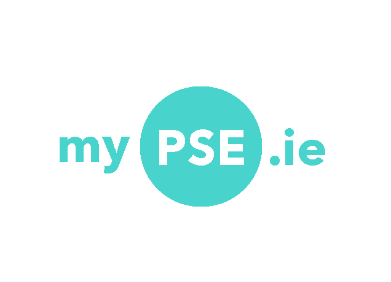

# Agile

## Overview

I utilised an Agile planning methodology during the development of MyPSE.ie.   

 

This was my first experience approaching a project using the Agile system and I encountered many challenges along the way.
Before this project I had successfully developed applications using the 'Waterfall' method which is a more direct, linear approach.
When learning a new skill, be it a programming language, project management methodology or any other learned technique, it can be extremely challenging to approach a project from a totally different perspective. Initially, that was my experience developing MyPSE.ie with Agile. 

I made a lot of planning errors while developing my KANBAN boards, Epics, and Issue Cards.
