# MyPSE.ie (My Passport for Special Education)

## Overview

MyPSE.ie is a full stack web application, designed to support pupils with Special Educational Needs (SEN), during educational transitions.  

 

For SEN pupils, parents and school staff, periods of transition between learning environments can be extremely challenging.

It is common practice during transitions within the Irish education system, that SEN pupils provide their new place of education with a document that will allow new teachers and support workers access to vital information about their care needs, learning supports, communication difficulties and more.  

Commonly referred to as 'passports', these documents can make an immesurable difference into understanding and providing care for SEN pupils during periods of transition.

MyPSE.ie allows authenticated and authorised pupils and parents to design, view and update passports reflecting not only each individual pupil's special educational needs, but also a nuanced overview of their personality and style. Teachers can then view the passports that have been assigned to them by entering their unique registration number issued by the Irish Teaching Council.

To protect pupils against data breaches and identity theft, MyPSE.ie will only allow passports to be created for pupils or by pupils who have been added to a separate database table by their school administration.

Utilising the power of coding frameworks like Django and Bootstrap, MyPSE.ie has been rapidly and thoughtfully designed to provide users with an enjoyable and meaningful experience as they securely access, create and organise SEN passports.

 

[Live project:](https://mypse.herokuapp.com/)

 

# Planning & Research

## Research

Due to the sensitive nature of this project and the potential vulnerability of its users, I was acutely aware that
I could not begin to develop such an application without
thoroughly and extensively researching the many complex challenges that
SEN pupils and their support networks face during periods of transition.

Whilst waiting for feedback from educational bodies, teachers and administrators was initially frustrating and time consuming, I feel the application is much more suited for use in the real world as a result of this.

Because of the exhaustive nature of the planning research, I have divided it up into more readable sections below.

Use Case.
 
Working as a Special Needs Assistant in various Special Education settings for the past fifteen years, I have witnessed first-hand the challenges faced by SEN pupils as they make transitions throughout their school lives. I have also bore witness to the exponential increase in technological innovation and implimentation within this field. The importance of every support availiable to children with special educational needs requires very little emphasis. I don't feel I need to make the case for SEN 'passports' as a continuing concept here. I do feel however, that a web application designed to create, update, organise and share passports would offer manifold advantages over sharing traditional physical documents.

 

_A traditional passport template._

 

I have outlined the following benefits:

1. Access to pupil passports would be more convenient for all users. 
 

2. Pupil passports would become uniform in design and layout, maximising effective and efficient use.
 

3. Passports would only have to be created once, requiring just simple, minor updates before further pupil transitions.
 

4. Parents and Teacher users can organise and manage multiple passports from the same application.
 

5. Passports can be easily updated in real time, meaning pupils and parents can include information they may have forgotten to include initially.
 

6. Users can learn about SEN passports, create them and share them all from a single, efficient application.
 

7. Users can protect their data by removing access to their passport when they transition to a new educational setting.

8. Digital passports can include a rich variety of content including images, stylised text and hyperlinks to resources, media and other important information that is beyond the scope of traditional physical passports.
 

    
Business Case.
     
    
 

1. There is currently no dedicated app available that offers pupils, parents, teachers and schools the ability to create and share pupil passports.
 

2. A dedicated app could be easily integrated into many existing school intranet systems such as 'Aladdin' or 'VS Ware' via URL link.
 

3. There has been a marked rise in diagnosis of children with Special Educational Needs [globally](https://blogs.ucl.ac.uk/cdld/2022/04/04/why-the-rise-in-number-of-sen-children-especially-in-the-early-years/)
 

    
NCSE Consultation.
     
    

 

[The National Council for Special Education](https://ncse.ie/about-us) is the independent statutory body responsible for improving “…the delivery of education services to persons with special educational needs arising from disabilities with particular emphasis on children”, in Ireland.

The NSCE provides a wide range of extensive resources, support and guidelines for persons within special education environments. One of the many ways the NCSE can offer support is during periods of transition.

The NCSE's expertise and authority on this subject made their website my first port of call. 

The information most relevant to my project was found within the following guidelines:

On page 11 of the excellent: 'CHANGING SCHOOLS, Moving from Primary to Post-Primary School' NCSE document (02156), It is stated that:

 “Parents and schools should exchange relevant information to assist planning for students with special education needs.” 

  
_Screenshot from NCSE's 'Changing Schools' document._

I also found this text within the same document to be remarkably similar if not identical to what a user story for a parent might look like for this project if re-ordered slightly.

 
_Screenshot from NCSE's 'Changing Schools' document with potential user story._

For example: "As a parent... I would like to share my knowledge and experience... to help the post-primary plan..."

In addition to the above, the NCSE doesn't just provide support for pupils during transitions between primary and secondary schools but also provides guidelines for other transitions which can be found [here.](https://ncse.ie/transitions-2)

I was curious to find out if MyPSE.ie could serve pupils involved across this whole spectrum of educational transitions. Including:

* Transitions between similar types of school.
* Transitions between classes within the same school.
* Transitions between primary and special schools.
* Transitions between early education and school (starting school)
* Other educational transitions

Naturally, and perhaps, somewhat naively, I thought I'd reach out to the NCSE in person.

Initially, I wanted to find out if an app like MyPSE.ie already existed perhaps as an underused feature of already existing software. I also wanted to know if the NCSE could advise me on the best way to approach the early part of the app's development.

 
_Email to NCSE Screenshot._

 I sent multiple emails to several departments outlining a basic proposal over a three week period only to receive a solitary email in which the NCSE stated categorically, that they would not be able to offer any me any feedback whatsoever.

 
_NCSE response._

Given the potential benefits of the project, I couldn’t understand why the NCSE were so reluctant to offer any advice or even constructive criticism of the app so I attempted to call the only person from the NCSE who actually replied to my many attempted communications, Caroline McKeown to ask for clarification on this issue.

During a productive phone call, I was informed that the NCSE could not commit to or be seen to endorse any project involving SEN pupils without conferring with any and all stakeholders in such a property including The HSE (Health Service Executive), The Department of Education and Skills and others. 

Whilst this refusal might have at first been disheartening, I am extremely grateful to the NCSE for having someone take the time to inform me about the relationships between governing bodies and how legally complex they can be. It also raised a pertinent question about software currently used within Irish schools. It was also suggested that with the exception of 'Esinet' administration software, educational and communication software is implemented at the discretion of each school.

    
Software in Irish Schools
     
    

 
Despite my initial disappointment with the NCSE's response (or lacktherof) to my emails, I quickly refocused my attention to other useful sources of information that might benefit the project. If I was going to have to develop the app without any official guidance or input from governing bodies I would have to come up with a strategy that would allow schools themselves to provide access to the passport functionality of the app allowing pupil and parent users to control and manipulate the flow of information between themselves and their assigned teachers. 

In order to do this, I would need to familiarise myself with the administrative processes and software systems used by schools during the transfer of enrolment details and successful pupil transitions. 

Luckily, the secretary at my current place of work, St Mary's Special School, Drumcar, is extremely approachable. Susan Hynes - one of the supporting heroes of this project - was always available and enthusiastic about helping me understand the systems and applications involved during the process of a pupil transition, whilst at no point revealing any privileged information. I was mainly concerned with what administrative software is currently used by the admin staff at St Mary’s and its provenance. 

I discovered the following:

For the transfer of pupils (enrolment) between schools, all Irish Special Schools use a web app called ‘POD’ (Primary Online Data) within the Department Of Education’s ‘Esinet’ umbrella application.

 
_Screenshot of Esinet software._

The first thing I noticed when I Susan sent me the above image was the tab marked 'PERSONAL' in the main 'Enrolment History' section.

 
_Screenshot of Personal tab._

As you can see from the following image though, this tab does not contain any biographical or useful information in relation to the successful transition of a pupil. I was confident that myPSE.ie's purpose is not already being fulfilled by this software.

The ‘POD’ app solely manages a pupil’s enrolment within a Primary-Level Education Setting. It contains no biographical information regarding a pupil’s personal life or educational ability. All Primary-Level Schools (Including Special Needs Schools) are required to use this app and it is the sole property of the Department of Education. As shown in the example image above, ‘POD’ provides the school administration with the enrolment history of any given pupil and includes enrolment dates and the class teacher for each year. Any given pupil can only be enrolled at one school at a time. When a School enrols a pupil they are then automatically removed from their previous Schools role book. I decided that this type of feature could be implemented for the adding and removing of teacher access to a pupil passport within the myPSE.ie app. 

In addition to the above I also thought it might prove unnecessary to include the pupil history of previous schools within the myPSE.ie project as the School Administration already has access to this data.

It became apparent at this stage, that department issued pupil ID numbers and school roll numbers would work perfectly as unique keys within the MyPSE.ie data models. Using real world ID numbers like this has many advantages, including easy authentication of pupils and future-proofing later versions of the app.

As a parent myself, and an SNA with 15 years experience and still employed in a ‘Special Educational Environment’, I am aware of the many software solutions available to mainstream schools and parents that are used on an every day basis.

 
_School software examples._

I referenced the above apps when considering the structural and UI elements of myPSE.ie.

Rather than doing a deep dive here I thought it would be more efficient to include only aspects of these apps that have influenced or inspired MyPSE.ie's design and functionality directly.

For example:

Class Dojo has an attractive, high contrast, mobile-friendly 
login page which allows users to login based on their 
relationship to the pupil/student.

 
_Class Dojo Login._

I thought that implementing a similar approach to user login would benefit MyPSE.ie's users, as they would be familiar with the concept of selecting a user role at login. 

Time constraints would restrict this option to a simple dropdown menu but the concept is what I considered to be most important initially.

I loved the subtle alternation of color between records in the esinet system. I thought this was an elegant way to separate entries and I replicated the style in MyPSE.ie's pupil record list template.  

 
_Alternating styling for list of records._

‘Aladdin' is a useful communication app that allows schools, teachers and pupils to communicate, share teaching and homework plans, share and log daily attendance as well as many other practical and useful features. This app could potentially be used to send the url of a pupils myPSE.ie passport or even just specific sections of the document to help teachers better understand specific issues relating to the needs of a given pupil. Aladdin's multi-purpose approach to managing daily school life influenced MyPSE's multi-user, multi-layered functionality.

At this stage it's worth pointing out that these apps are indeed multi-dimensional and have communication channels dedicated to informing teachers of SEN pupils needs and issues in real time. So I understand why this might seem confusing to people reading this documentation that are unfamiliar with special education transitions.

What MyPSE.ie offers is information for reference during periods of transition.Passports are by no means the be all and end all of teacher-parent communication. They do however play a vital role in providing a general overview of an SEN pupil at a time when more detailed information is not forthcoming and working relationships and routines have yet to be developed.

Of all of these apps I inspected, Seesaw had the most effect regarding visual style and I based a lot of my UI design choices on its simple, high-contrast approach.

Further into my research, I discovered other applications that heavily influenced my thinking during the initial development of MyPSE.ie. I discuss these in the 'Interviews.' tab below.

    
Interviews/Design Thinking.
     
    

 

Working in a special education environment when developing an app for SEN pupils has it's advantages as evidenced earlier in this document by Susan Hynes and in [other projects](https://github.com/davidcalikes/Marvelous-Matching) I have developed. 

I was concious however, that working on a project with feedback coming from the teachers and pupils of just one school would be sub-optimal to say the least. I was determined not to let any bias (positive or negative), influence the design of the application. I didn't want the research for MyPSE.ie to be based on people that might just be telling me what I wanted to hear or those who might base their responses to questions on what they thought of me as an individual.
    
So I reached out (via telephone) to a local school in my area: St Josephs National School, Kingscourt, and arranged with Christina Meade, a teacher from 'Cairde' (St Joseph's ASD Unit) to arrange a quick telephone survey about MyPSE.ie.

I consulted with St Mary's Vice Principle Declan McCoy as I formulated questions for Christina. In a somewhat fortunate twist of fate Declan provided me with information that came up during a recent teacher-training course that took place earlier that week. While discussing software in schools during the training a course instructor divulged that 
[Google Workspace For Education](https://edu.google.com/workspace-for-education/editions/education-fundamentals/) has "some integrated passport functionality". 

One of the sticking points that administrators where having difficulty with was the transfer of access priveleges to the assigned teacher and protecting the data of the pupil.

Whilst I was initially disappointed that I had not known about this GWSE feature, I came around to realising that the unique proposition of MyPSE.ie doesn't lie simply in the digitisation of pupil passports and that if anything, for Google to include passport functionality in its suite of education platforms only serves to strengthen the business case for a dedicated app like MyPSE.ie.

I also liked the idea of solving an issue that even Google users seemed to be having problems with. Declan was also kind enough to help me formulate some of the research questions for Christina Meade.

I have listed the full questions and responses below:

1.  Q -- "How would you describe your experiences with pupil passports?"
 
    A -- "If we recieve a pupil passport (we sometimes don't), its usually a folder or poly pocket containing a few A4 sheets of background information on the child (pupil). They are never the same, and it can be hard to make sense of some of them. Sometimes there are scrapbook style folders that contain family pictures and artwork from the child and you can tell that effort has been made by whoever put them together. Those are the ones that you get the most out of. 

2.  Q -- "Do you find the information contained within pupil passports useful?"
 
    A -- "Not really, it can be hard to find to be honest. I suppose any extra background information is welcome but it would't always be there when you went looking for it. I don't think parents are aware what information to include and sometimes include information that isn't relevant, incomplete or outdated.

3.  Q -- "Do you provide parents with a template for transition passports during the pre-enrolment period?"
 
    A -- "Yes, It's something that we've been doing since I started working here, its an A4 sheet but I'd have to look for it I don't have one on me at the moment."

4.  Q -- "Do you think the passport template you provide for transitions is missing anything?"
 
    A -- "No from what I remember its laid out quite well, the problem is more parents not sending them back or not following the template. I do like it when the scrapbooks are sent in though, and the more pictures the better."

5.  Q -- "How would a web application that allowed users to create and securely share digital passports be of benefit?"
 
    A -- "I think it would make it easier if they were all in the one place and you could access them from your phone or iPad. I think the inconvenience is something that puts a lot of parents off. It might make them more likely to actually make a passport in the first place if they can make one on a website."

6.  Q -- "What concerns would you have about using a web app that shared pupil passports"
 
    A -- "Security obviously. Is that something you could do? I think some of the older teachers might still prefer to use the actual documents but most people have at least a smartphone these days. There might be issues about data protection as well so you'd probably have to look into that."
 
Although I was tempted to ask follow up questions after each response, especially after the first question where I really wanted Christina to elaborate more on instances where passports have proved useful but I only asked the questions I had prepared for the interview. I didn't want try and manipulate the answers I wanted out of the interview.

I appreciate Christina for taking the time to answer the questions. I followed up the interview a week later and we discussed what I gleaned from the interview via email.

I laid out what I thought were key features that the first (Minimum Viable Product) Version of MyPSE.ie should contain in order to address the issues raised during the interview.

* Users should be authenticated before they can create passports.
* Creating a passport should be made simple (a single form) to encourage users to use the platform.
* Passports should contain photographs and the layout should be the same for each pupil in order to quickly and easily access information.
* The app should be accessible from virtually any device with a modern web browser.
* Teachers should be given the option to print physical passports. (Time permitting)

 
_Email Response from Christina._

As I mentioned above, working in a special needs school has it's advantages when approaching a project like this. Working as an SNA however makes some things slightly more difficult. It is teachers in schools that have the (legal) 'duty of care' for a pupil within a school and are therefore entitled to access confidential information that an SNA is not. As is clear from Christina's response the issue with the transfer and removal of access to pupil passports is something that I didnt initially recognise as a major problem.

Here is where I think a rigorous approach to planning has resulted in a much more robust application.

The next step during the planning stage of MyPSE.ie was a meeting with Richard Wells. Richard has been my assigned mentor since I began my studies with the [Code Institute](https://codeinstitute.net/ie/full-stack-software-development-diploma/)

During our meeting we discussed the idea and while Richard admitted he liked the proposal he touched upon a point that I had (yet again) not considered. 

Many SEN pupils are highly capable and could easily (with guidance and support) create and style their own passports. Up to this point, I had been focused so heavily on the types of pupils I have been working with for the past 15 years (pupils within the moderate to severe and profound range of intellectual disability), I had completely ignored an entire user group that could benefit from the app. As usual, I am immensely grateful to Richard for his wisdom and guidance through my continuing education in software development.

So with some haste I arranged a meeting with a teacher from a mainstream school whom I knew to teach SEN pupils.

Unfortunatly, there was no guarding against bias here. I would just have to try and be aware of my questioning and pay as much attention to the responses as possible. I also had no time or expert support like I had with Declan to formulate a new set of questions.  

The teacher in question: Aine Lynch of St Joseph's Secondary School in Rush Co.Dublin (yes both schools where really called St Joseph's) Has been a friend of mine for the past 20 years since I first moved to Ireland. A fellow musician, Aine is the year 6 head, a classroom teacher and a [SET](https://ncse.ie/special-classes) Class teacher.

Notes made during our discussion.

* MyPSE.ie would be of more benefit to St Joseph's than the current passport system. Aine told me that teachers and admin staff at St Joseph's use software called [VSWARE](https://www.vsware.ie/) The information contained within this software most relevant to pupil transitions is limited to a single text field.

* While Aine appreciated the concept of MyPSE.ie she was concerned about having yet another app to manage on top of a growing number of apps. Aine also thought that most other teachers would share this concern. MyPSE.ie being a standalone app might be a disadvantage in this case so an option to embed the app in future should be something to consider.

* While almost all of the SEN pupils who attend St Joseph's (Rush) would have the capability to create a passport online they would need what Aine describes as "scaffolding". In other words a step-by-step guide that they could follow whilst creating their passports.

* Aine also came up with an idea to allow pupils the option to customise their passports. This runs counter my own idea of making the passports uniform to make it easier to find information.

* Aine informed me that out of 900 pupils in ST Joseph's, 300 of those pupils are classed as having Special Eduacational Needs.
 
I'm grateful to Aine for her meeting me and helping extend the scope of the project. It would be dishonest of me to say I wasn't beginning to feel anxious at this stage in the project. But looking back now I think the product is much more inclusive and beneficial to pupil users because of Aine's valuable feedback.

The next area of research was tricky. I have made many friends over the years working as an SNA and have a number of former pupils and parents that I was sure would have been glad to help me gain perspective from a different user viewpoint. But for two reasons I decided not to go down this route. Firstly, as I have already mentioned, I wanted to protect the proposal against biased responses and secondly I felt a little uneasy and borderline exploitative just thinking about it from an ethical standpoint.

So I decided to use what I had learned during the 'design thinking' section of the Code Institute's LMS course content and put together a 'persona template'.

What's remarkable here, is how similar the persona template is to a pupil passport. 

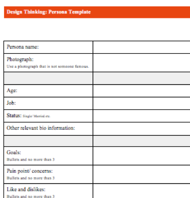 
_Code Institute - Persona Template._

Here is the template I created. I wanted to make a template for a non-verbal user first. The reasoning behind this was that it is those who cannot speak for themselves that stand to benefit the most from MyPSE.ie. 

Persona Name: 
* John Osawa

Age:
* 11

Job/Role: 
* Pupil

Status:
* Minor

Other Information:
* non-verbal.
* non-ambulant (requires a wheelchair).
* has epilepsy.

Goals:
* To be respected and treated with dignity.
* To be included, despite my disabilities.
* Academic achievement.

Pain Point/Concerns:
* People sometimes fail to consider what I want because I can't verbalise it for myself.
* I'm afraid I might be excluded from fun activities because I can't let them know when I want to take part
* I love swimming but people I'm anxious they wont know that in my new school

Likes/Dislikes

* I don't like it when people ignore or talk about me and assume I can't understand them just because I have disabilities. 

* I like it when people take the time to talk to me and patiently allow me to communicate with them.

* I like when people really know me and what I like and need. It saves me a great deal of frustration. You might know I like football, but do you know my favorite team is FC Barcelona?

Empathetic excercises like this are second nature to an SNA. It is I suppose, the app's raison d'être.

## Problem Statement

 

The following problem statement was created as a result of developing this persona,

"To help facilitate successful educational transitions, pupils, parents and teachers should share vital information, so they can better understand a pupil's desires, needs and personality."

 

## Research Summary
 

* A digital 'passports' web app has both a real-world, practical use case and real-world business use case.

* The primary goal of the app should be to create a viable solution to the problem contained in the problem statement created during the planning stages of development. 

* The app should be 'standalone' and available for instant, easy adoption by any Irish school.

* Authentication should be required for CRUD interactions.

* Users should be instructed to select their user 'role' at registration.

* The application should use existing, 'real-world' ID numbers to ensure passports are genuine and to future-proof later versions of the app.

* Relevant sections of the app should reflect the design and layout of traditional style passports, and similar education based software to provide users with a sense of familiarity and confidence.

* Users should be instructed to select their user 'role' at login.

* Teachers access privileges should be revoked when a new teacher is assigned to a pupil.

* Pupil and parent users should be able to style the text content of their passports to better express the personality and tastes of the pupil.

* Users should be provided with visual feedback and guidance about how to use the app. 

 

# User Experience Design

## Target Audience

MyPSE.ie aims to provide its service to all Irish based SEN School Pupils and their representitives. The application also benefits teachers and schools within the Irish education system.
 

### Target Audience summary

* Users who are SEN pupils that are making educational transitions.

* Users who are parents of SEN pupils that are making educational transitions.

* Users who are teachers of SEN pupils making educational transitions.

* Users who are school administrators that want to facilitate SEN pupils who are making educational transitions.

 

## User Stories
 

#### __General User Stories__
 

* As a User, I would like the app to be intuitive and easy to navigate in order to access information efficiently.

* As a User I would like to login/logout easily depending on my user role in order to easily access information.

* As a User I want to be Informed when I have submitted a task or action within the app so I can be confident it has been successfully completed.

* As a User I want the app to be easy to read, consistent in design and pleasing to the eye so I will have a positive user experience.

* As a User I would like to access an About page in order to learn more about myPSE.ie

 

#### __User Stories__: *Site Owner*
 

* As a Site Owner, I would like to prevent the ability to create a passport unless a pupils details have been registered by their school in order to prevent misuse of the site.

* As a Site Owner, I would like to limit the number of passports to one passport per pupil in order to prevent misuse of the site and prevent misidentification of the pupil.

* As a Site Owner, I would like to restrict access to passports to authorised and authenticated users only in order to protect pupil data. 

* As a Site Owner, I would like to restrict access to passports based on user role in order to protect pupil data.

* As a Site Owner I would like to automate the transfer of passport teacher permissions in order to protect user data.

* As a Site Owner I would like to automatically delete passports when pupil is no longer enrolled in school in order to protect user data.

 

#### __User Stories__: *Role -- School Admin*
 

* As a School Administrator, I would like to create pupil records in order to facilitate the use of myPSE.ie  passports.

* As a School Administrator, I would like to securely login and out of the application in order to prevent unauthorised access to pupil information. 

* As a School Administrator, I would like to view a list of Enrolled Pupils in order to maintain a record of pupils who can benefit from myPSE.ie.

* As a School Administrator, I would like to update and delete pupil details in order to maintain accurate records.

 

#### __User Stories__: *Role -- Parent*
 

* As a Parent, I would like to create a ‘passport’ for my SEN child to support them during educational transitions.

* As a Parent, I would like to securely login and out of the application in order to prevent unauthorised access to my child’s data.

* As a Parent, I would like to view a list created passports in order to keep track of and access them. 

* As a Parent, I would like to select, edit and delete any Passports I have created in order to maintain accurate data, as well as protect my child’s data.

* As a Parent I would like the User Experience of myPSE.ie to be intuitive and illicit a positive emotional response in order to encourage repeat visits to the app.

* As a Parent, I would like to customise my child’s passport to reflect their personality and tastes in order to provide a more accurate profile of my child. 

* As a Parent, I would like the option to print a ‘printer friendly’ version of my child’s passport in order to provide people outwith the education system with information that will help during a non-educational transition. (Respite facilities, youth clubs, sports teams etc.)

 

#### __User Stories__: *Role -- SEN Pupil*
 

* As an SEN Pupil I would like to create a passport to help others understand my needs, personality, tastes and abilities so they are better informed and equipped to assist me as I transition between Special Educational environments.

* As an SEN Pupil, I would like to securely login and out of the application in order to prevent unauthorised access to my data.

* As an SEN Pupil, I would like the User Experience of myPSE.ie to be intuitive and illicit a positive emotional response in order to encourage repeat visits to the app.

* As an SEN Pupil, I would like to view and edit my passport in order to maintain accurate data across time.

* As an SEN Pupil, I would like myPSE.ie to provide me with the ability to delete my own Passport as is my right.

* As an SEN Pupil, I would like  to customise my passport to reflect my personality and tastes in order to help people understand me.

* As an SEN Pupil, I would like the option to print a ‘printer friendly’ version of my passport in order to provide people outwith the education system with information that will help during a non-educational transition. (Respite facilities, youth clubs, sports teams etc.)

 

#### __User Stories__: *Role -- Teacher*
 

* As an Teacher, I would like to securely login and out of the application in order to prevent unauthorised access to pupil data.

* As a Teacher, I would like to view a list of all passports assigned to my Teacher ID number in order to 
conveniently access their passports.

* As a Teacher, I would like to view the passports of children transitioning into my class in order to prepare supports, staff and educational resources to better facilitate their transition.

 

## Objectives of MyPSE.ie

 

* To make MyPSE.ie a viable solution to an existing problem.

* To make the purpose of the app obvious to the user.

* To provide users with an enjoyable, intuitive and easy to use interface.

* To provide users with a positive user experience, underwritten by feelings of familiarity, confidence and security.

* To provide a positive user experience whilst protecting user data.

 

## Approach
 

* The information will be displayed to the user logically and informed by planning and research.

* The app will be created following the principles of user experience design.

* The app's functionality will depend on the 'role of the user.

* The app will be simple to use and provide visual feedback for all users.

* The app will include an extensive guidance section including printable documents.

* The app will allow SEN pupils and their representatives to create personal, stylised passport documents.

* The app will follow strict data privacy guidlines

 

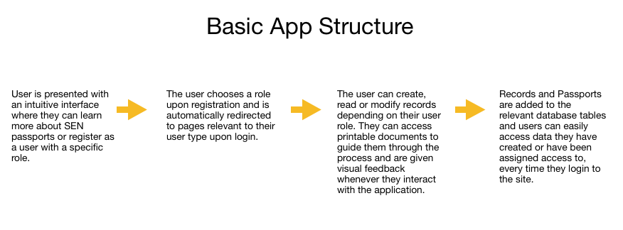 
_Basic App Structure_

## Data Flow

In order for MyPSE.ie to function as a stand alone application, I had to consider how to verify the identity of the SEN pupils who benefit from it. I wanted to do this for two reasons. Firstly to protect against identity theft and data breaches. Secondly, to make sure that anyone who creates a passport using MyPSE.ie is doing so for all of the correct reasons. I became hyper consious of how simple it might be to create a 'fake' passport using images found online as I was creating the sample passports for reference purposes. Should an individual be able to create a passport without verification, hypothetically they could misuse it in order to gain access or influence in other areas of special education, the health service or other areas of public life.

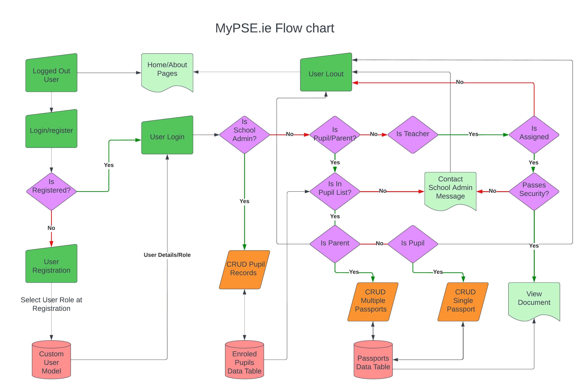 
_Flow Chart_

## Database Schema

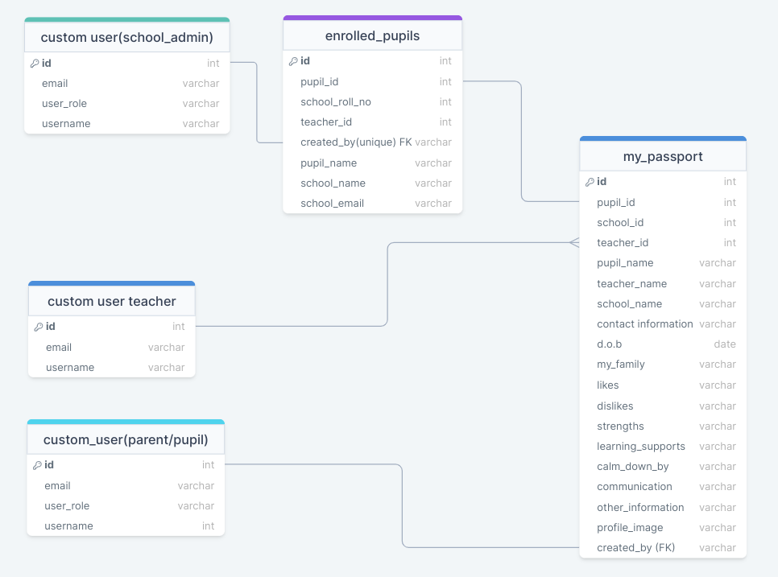 
_Flow Chart_

There are two 'real-world' data sources I have used to help me create my custom data models for this project. The Enrolled Pupils List data table has fields derived from the Department of Education's POD (Primary Online Database) application. 

 
_POD application_

As I mentioned in the planning section earlier, the 'pupil id' and 'school roll no' fields provide unique identifiers for both schools and pupils. At the moment school roll numbers are only validated by REGEX validator code but I thought this was a good enough security measure for the moment as anyone trying to add a pupil record would at least have to know the unique format of a valid school roll number before they can create a pupil record. In future versions of the app, this field could be linked to a separate data table containing the roll number of every Irish school. The pupil ID field is a unique identifier for every school pupil in Ireland. The idea behind using this was to guarantee that as long as school administrators used this number, they wouldn't have to come up with their own system for creating and storing separate, unique pupil id numbers. Another advantage would be that schools, teachers, pupils and their parents would have one less number to remember.

The Passport custom data model was created using the fields from the 4 schools 'Planner for Teachers of Special Education Classes". This was in order to narrow the scope of information to only the most vital fields required. The Excellent 4 schools planner was produced in accordance with NCSE and Department of Education guidelines so it also meant that MyPSE.ie passports would conform to these guidelines by proxy and I could be confident the passports would contain everything required and nothing superfluous. 

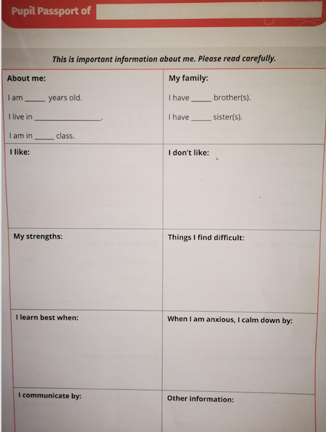 
_4 Schools Planner Passport_

The relationships between the data tables are designed in order to solve the problem regarding the transfer of teacher access to pupil passports. To conform to privacy policy, only one teacher can be assigned access to a pupils transition document at any given time. To solve this issue, MyPSE.ie puts the pupils and parents in command of who can view their passports and when. They can even revoke access altogether if they choose. When pupils become enrolled in the MyPSE.ie Enrolled Pupil List data table they are given a Physical Document by their school adminitistration staff containing the Teacher ID number of their assigned teacher. This ensures they will have complete control over who views their passport and also that they can transfer teacher privileges instantly upon future educational transitions.

# Visual Design

## Wireframes

I designed wireframes for reference as I began to develop the application. They are instructive as to how the site should display across multiple device widths.

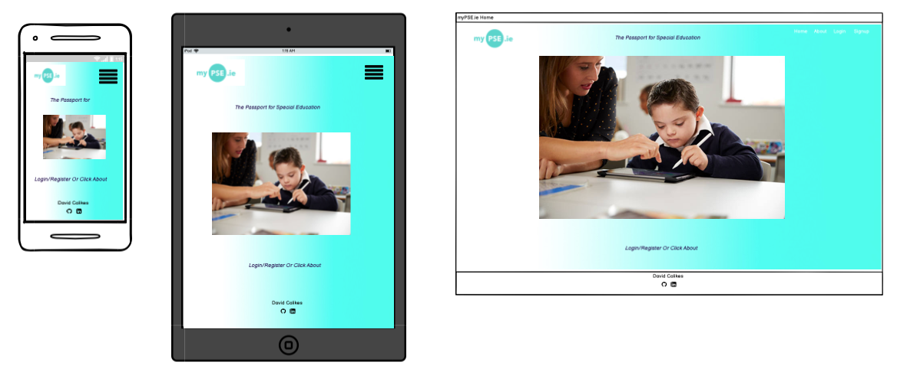 
_Home Page Wireframe_

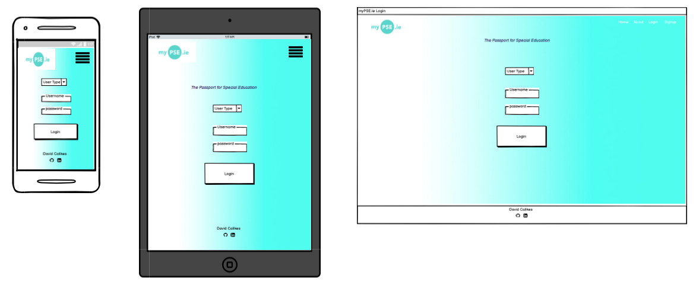 
_Login Page Wireframe_

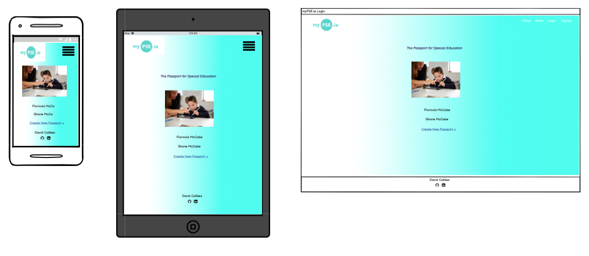 
_Passport List Wireframe_

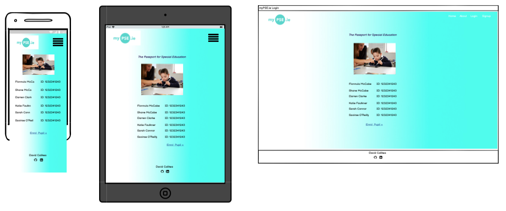 
_School Admin Wireframe_

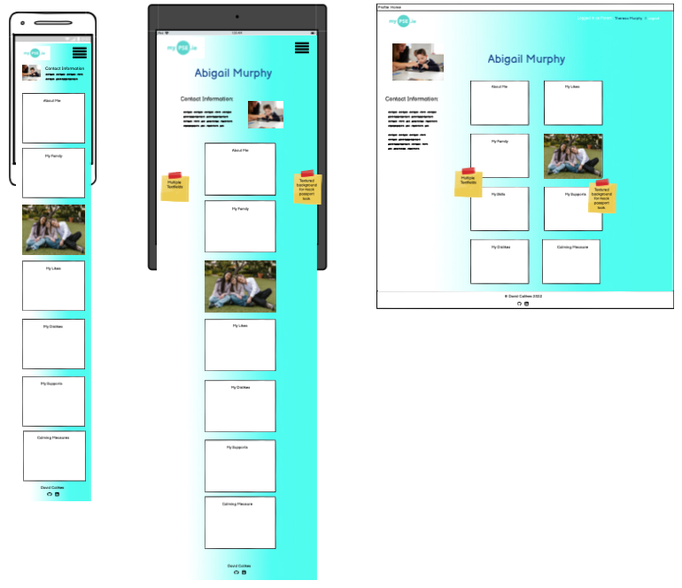 
_Passport Wireframe_

Due to the scope of this application and how similar many of the pages are, I thought it unnecessary to include every single page here. Take the passport page for example. The passport layout will be the same for every user type except for minor visual/functional changes such as the removal of edit/delete buttons for teachers. The wireframes reflect the general feeling I had at the beginning of the project regarding the styling, layout and functionality. 

## Color Scheme

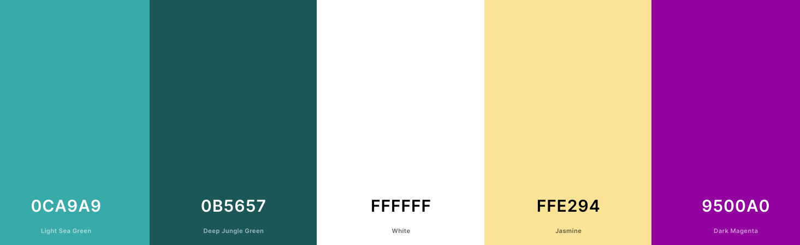 
_MyPSE.ie Color Scheme_

The colors used throughout the site are listed above. They are positive colors without being brash and are evocative of the Irish tricolor flag. (MyPSE.ie being an exclusively Irish enterprise) 

The contrasting dark magenta color was used as a natural compliment to the greens and is used as an indicator for hover pseudo elements, overwriting bootstrap's default blue.

## Nav and Footer Gradient

 
_MyPSE.ie Nav & Footer Gradient_

The Nav and Footer elements of the site have a white to green gradient set on a textured 'scribble' background. The gradient from neutral white to positive green (for go!) symbolises the 'transition' of SEN pupils and the textured background informs their often tumultuous nature.

The nav gradient reduces in severity across smaller screen widths in order to maintain a high contrast ratio for the MyPSE.ie logo.

## Background Gradient

 
_MyPSE.ie Background Gradient_

The background gradient of MyPSE.ie features a subtle vertical waves pattern. This is designed to look similar to the watermarked paper of a traditional travel passport. (See example below)

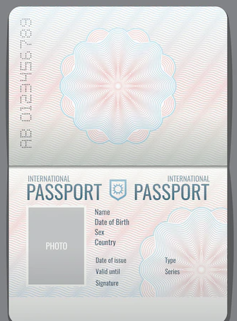 
_Watermarked paper example_

The reasoning behind this was to project a sense of fun and adventure into the transition process as well as being suggestive of beurocratic competence and security.

 

## Typography

*  There are two fonts used throughout the application.

    * Lato: A strong, elegant font for heading elements to project a professional, secure application. 
   
    * Helvetica: A clear, familiar and accessible font is used in paragraph text.

    The fonts were imported to the stylesheet via Google fonts.

 

## Naming The App

I researched many naming options for the application but many of the names I considered were already established apps or unavailable as .ie domains.

A .ie domain was required to communicate the app's area of operation.

I originally wanted to call the app "Class Pass" but a quick google search led me to a globally recognised gym class management app of the same name.

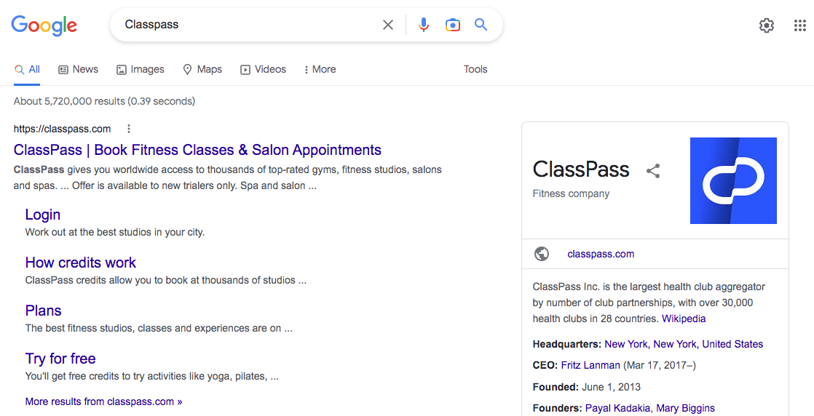 
_ClassPass_

There is also a women-only gym in Cork city occupying the classpass.ie domain.

I abandoned this idea and then tried to come up with an acronym which would include the title letters of each of the following words.

* P for Passport

* S for Special

* E for Education

* T for transitions

S.T.E.P was the obvious choice here, as it could imply progression and assistance but it didn't work as a coherent sentence when laid out. Special Transitions Education Passports was confusing and illogical. In any case when I Googled "STEP app" the search returned yet another established fitness application. 

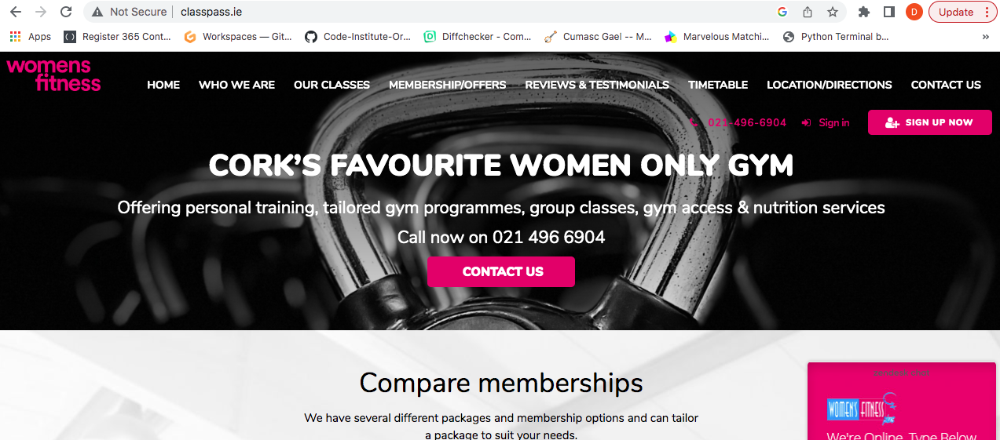 
_STEP app_

Eventually MyPSE.ie was chosen. A lot of Irish public service applications use the prefix 'My' for apps that provide services (MyGov, MyID, MyWelfare etc.) so I decided this would perfectly communicate the administrative, personal and facilitative nature of the application. I also liked the rhyming qualities of the letter 'E' in PSE and the 'e' from the .ie extension. 

This is already practiced by the following Irish websites and is a nice, subtle way of making a domain name instantly more memorable.

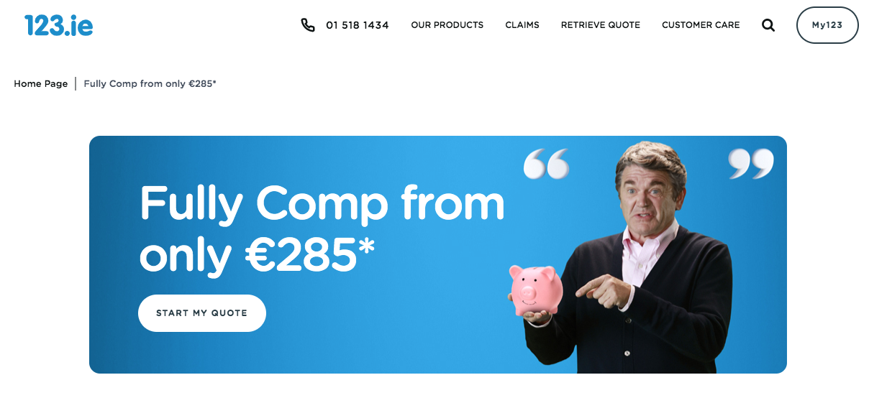 
_123.ie_

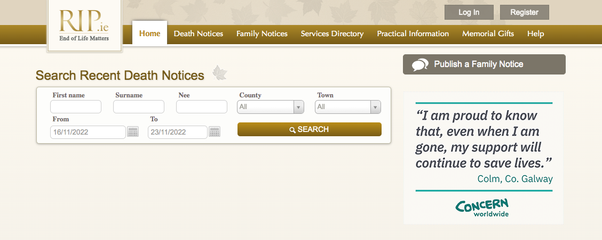 
_RIP.ie_

I made an application to purchase the MyPSE.ie domain name and was successful.

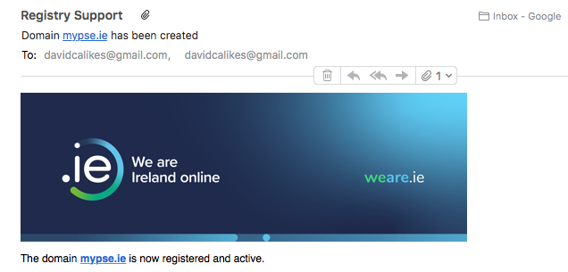 
_MyPSE.ie Domain Registration_

# Features

## Nav Bar
## Footer
## Home Page
## About Page
## Learn More Page
## User Guides
## Sample Passports
## Authentication & Authorisation
## Pupil List Page
## Pupil Record Form Page
## Pupil Record Page
## Passport List Page
## Pupil ID Check Page
## Passport Form Page
## Passport Page
## Teacher Pupil List Page
## Teacher Pupil ID Page
## Teacher Passport Page
## Added Security Features

# Deployment

MyPSE.ie was deployed to heroku early during development. I wanted to make sure the database and static files were all accessible from the beginning of the project so I wouldn't have to worry about deployment errors closer to releasing the app.

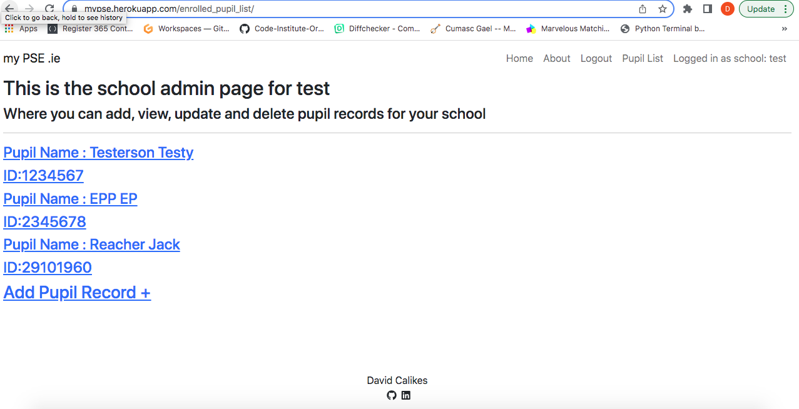 
_Early Deployment Screenshot_

## Deployment errors and issues

### Security Key.

Whilst setting up the development environment for this project I made the error of accidentally pushing to Github (ergo exposing) the SECURITY_KEY variable within the settings.py file. This variable was part of the code institute's student project template which I used in order to expidiate the initial setup phase of project. I imediately changed this variable and concealed it within the env.py file which was then subsequently added to .gitignore. The CI's variable was never at any point used as a functioning key during the development or deployment of the app.  

