# MyPSE.ie (My Passport for Special Education)

## Overview

MyPSE.ie is a full stack web application, designed to support pupils with Special Educational Needs (SEN), during educational transitions.  

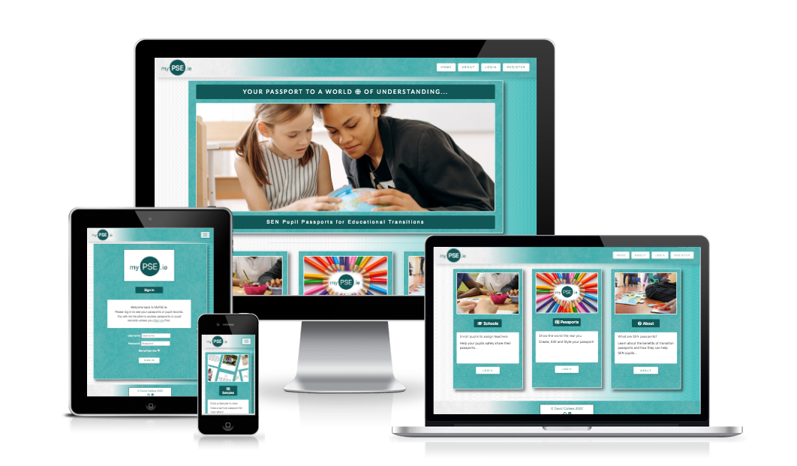

 

For SEN pupils, parents and school staff, periods of transition between learning environments can be extremely challenging.

It is common practice during transitions within the Irish education system, that SEN pupils provide their new place of education with a document that will allow new teachers and support workers access to vital information about their care needs, learning supports, communication difficulties and more.  

Commonly referred to as 'passports', these documents can make an immesurable difference into understanding and providing care for SEN pupils during periods of transition.

MyPSE.ie allows authenticated and authorised pupils and parents to design, view and update passports reflecting not only each individual pupil's special educational needs, but also a nuanced overview of their personality and style. Teachers can then view the passports that have been assigned to them by entering their unique registration number issued by the Irish Teaching Council.

Because of the highly personal and sensitive nature of the data stored within the site, protection of this data is paramount which is why MyPSE.ie will only allow passports to be created for pupils or by pupils who have been added to a separate database table by their school administration.

Utilising the power of coding frameworks like Django and Bootstrap, MyPSE.ie has been rapidly and thoughtfully designed to provide users with an enjoyable and meaningful experience as they securely access, create and organise SEN passports.

 

[Live project:](https://mypse.herokuapp.com/)

 

# Planning & Research

## Research

Due to the sensitive nature of this project and the potential vulnerability of its users, I was acutely aware that
I could not begin to develop such an application without
thoroughly and extensively researching the many complex challenges that
SEN pupils and their support networks face during periods of transition.

Whilst waiting for feedback from educational bodies, teachers and administrators was initially frustrating and time consuming, I feel the application is much more suited for use in the real world as a result of this.

Because of the exhaustive nature of the planning research, I have divided it up into more human readable sections below.

Use Case.
 
Working as a Special Needs Assistant in various Special Education settings for the past fifteen years, I have witnessed first-hand the challenges faced by SEN pupils as they make transitions throughout their school lives. I have also bore witness to the exponential increase in technological innovation and implimentation within this field. The importance of every support availiable to children with special educational needs requires very little emphasis. I don't feel I need to make the case for SEN 'passports' as a continuing concept here. I do feel however, that a web application designed to create, update, organise and share passports would offer manifold advantages over sharing traditional physical documents.

 

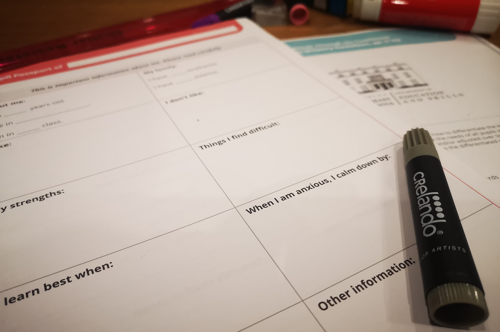

_A traditional passport template._

 

I have outlined the following benefits:

1. Access to pupil passports would be more convenient for all users. 
 

2. Pupil passports would become uniform in design and layout, maximising effective and efficient use.
 

3. Passports would only have to be created once, requiring just simple, minor updates before further pupil transitions.
 

4. Parents and Teacher users can organise and manage multiple passports from the same application.
 

5. Passports can be easily updated in real time, meaning pupils and parents can include information they may have forgotten to include initially.
 

6. Users can learn about SEN passports, create them and share them all from a single, efficient application.
 

7. Users can protect their data by removing access to their passport when they transition to a new educational setting.

8. Digital passports can include a rich variety of content including images, stylised text and hyperlinks to resources, media and other important information that is beyond the scope of traditional physical passports.
 

    
Business Case.
     
    
 

1. There is currently no dedicated app available that offers pupils, parents, teachers and schools the ability to create and share pupil passports.
 

2. A dedicated app could be easily integrated into many existing school intranet systems such as 'Aladdin' or 'VS Ware' via URL link.
 

3. There has been a marked rise in diagnosis of children with Special Educational Needs [globally](https://blogs.ucl.ac.uk/cdld/2022/04/04/why-the-rise-in-number-of-sen-children-especially-in-the-early-years/)
 

    
NCSE Consultation.
     
    

 

[The National Council for Special Education](https://ncse.ie/about-us) is the independent statutory body responsible for improving “…the delivery of education services to persons with special educational needs arising from disabilities with particular emphasis on children”, in Ireland.

The NSCE provides a wide range of extensive resources, support and guidelines for persons within special education environments. One of the many ways the NCSE can offer support is during periods of transition.

The NCSE's expertise and authority on this subject made their website my first port of call. 

The information most relevant to my project was found within the following guidelines:

On page 11 of the excellent: 'CHANGING SCHOOLS, Moving from Primary to Post-Primary School' NCSE document (02156), It is stated that:

 “Parents and schools should exchange relevant information to assist planning for students with special education needs.” 

 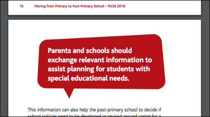 
_Screenshot from NCSE's 'Changing Schools' document._

I also found this text within the same document to be remarkably similar if not identical to what a user story for a parent might look like for this project if re-ordered slightly.

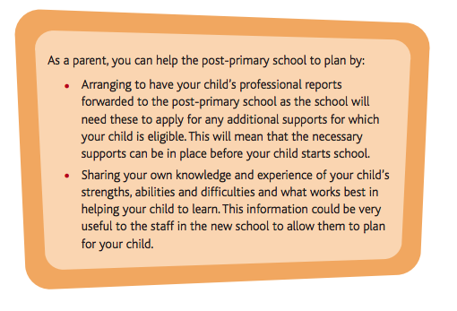 
_Screenshot from NCSE's 'Changing Schools' document with potential user story._

For example: "As a parent... I would like to share my knowledge and experience... to help the post-primary plan..."

In addition to the above, the NCSE doesn't just provide support for pupils during transitions between primary and secondary schools but also provides guidelines for other transitions which can be found [here.](https://ncse.ie/transitions-2)

I was curious to find out if MyPSE.ie could serve pupils involved across this whole spectrum of educational transitions. Including:

* Transitions between similar types of school.
* Transitions between classes within the same school.
* Transitions between primary and special schools.
* Transitions between early education and school (starting school)
* Other educational transitions

Naturally, and perhaps, somewhat naively, I thought I'd reach out to the NCSE in person.

Initially, I wanted to find out if an app like MyPSE.ie already existed perhaps as an underused feature of already existing software. I also wanted to know if the NCSE could advise me on the best way to approach the early part of the app's development.

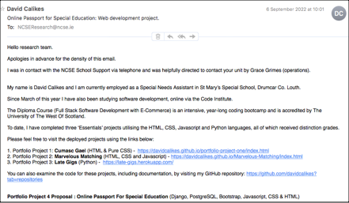 
_Email to NCSE Screenshot._

 I sent multiple emails to several departments outlining a basic proposal over a three week period only to receive a solitary email in which the NCSE stated categorically, that they would not be able to offer any me any feedback whatsoever.

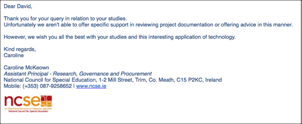 
_NCSE response._

Given the potential benefits of the project, I couldn’t understand why the NCSE were so reluctant to offer any advice or even constructive criticism of the app so I attempted to call the only person from the NCSE who actually replied to my many attempted communications, Caroline McKeown to ask for clarification on this issue.

During a productive phone call, I was informed that the NCSE could not commit to or be seen to endorse any project involving SEN pupils without conferring with any and all stakeholders in such a property including The HSE (Health Service Executive), The Department of Education and Skills and others. 

Whilst this refusal might have at first been disheartening, I am extremely grateful to the NCSE for having someone take the time to inform me about the relationships between governing bodies and how legally complex they can be. It also raised a pertinent question about software currently used within Irish schools. It was also suggested that with the exception of 'Esinet' administration software, educational and communication software is implemented at the discretion of each school.

    
Software in Irish Schools
     
    

 
Despite my initial disappointment with the NCSE's response (or lacktherof) to my emails, I quickly refocused my attention to other useful sources of information that might benefit the project. If I was going to have to develop the app without any official guidance or input from governing bodies I would have to come up with a strategy that would allow schools themselves to provide access to the passport functionality of the app allowing pupil and parent users to control and manipulate the flow of information between themselves and their assigned teachers. 

In order to do this, I would need to familiarise myself with the administrative processes and software systems used by schools during the transfer of enrolment details and successful pupil transitions. 

Luckily, the secretary at my current place of work, St Mary's Special School, Drumcar, is extremely approachable. Susan Hynes - one of the supporting heroes of this project - was always available and enthusiastic about helping me understand the systems and applications involved during the process of a pupil transition, whilst at no point revealing any privileged information. I was mainly concerned with what administrative software is currently used by the admin staff at St Mary’s and its provenance. 

I discovered the following:

For the transfer of pupils (enrolment) between schools, all Irish Special Schools use a web app called ‘POD’ (Primary Online Data) within the Department Of Education’s ‘Esinet’ umbrella application.

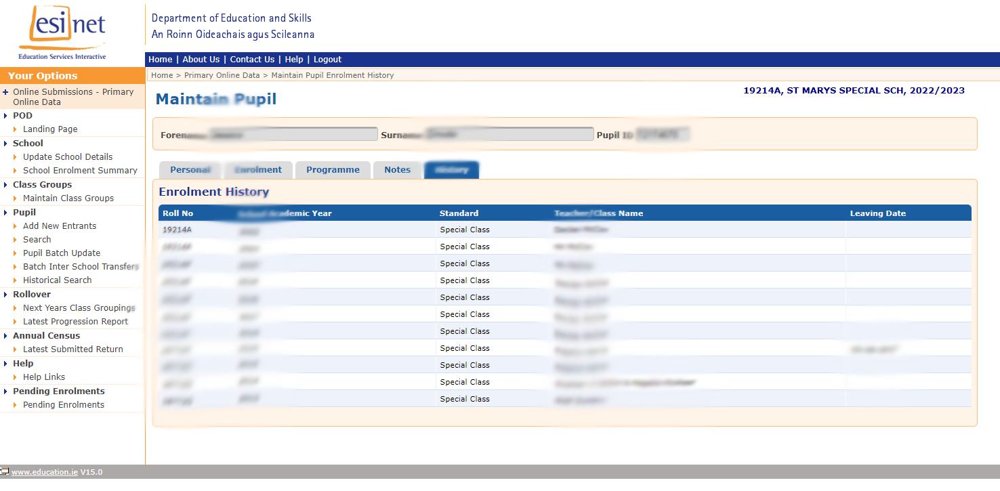 
_Screenshot of Esinet software._

The first thing I noticed when I Susan sent me the above image was the tab marked 'PERSONAL' in the main 'Enrolment History' section.

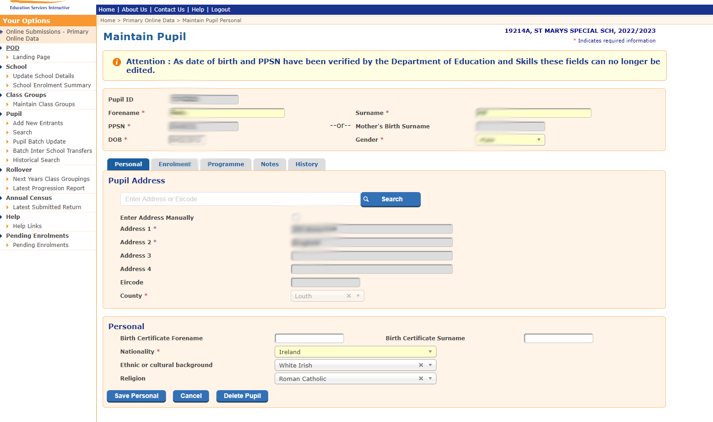 
_Screenshot of Personal tab._

As you can see from the following image though, this tab does not contain any biographical or useful information in relation to the successful transition of a pupil. I was confident that myPSE.ie's purpose is not already being fulfilled by this software.

The ‘POD’ app solely manages a pupil’s enrolment within a Primary-Level Education Setting. It contains no biographical information regarding a pupil’s personal life or educational ability. All Primary-Level Schools (Including Special Needs Schools) are required to use this app and it is the sole property of the Department of Education. As shown in the example image above, ‘POD’ provides the school administration with the enrolment history of any given pupil and includes enrolment dates and the class teacher for each year. Any given pupil can only be enrolled at one school at a time. When a School enrols a pupil they are then automatically removed from their previous Schools role book. I decided that this type of feature could be implemented for the adding and removing of teacher access to a pupil passport within the myPSE.ie app. 

In addition to the above I also thought it might prove unnecessary to include the pupil history of previous schools within the myPSE.ie project as the School Administration already has access to this data.

It became apparent at this stage, that department issued pupil ID numbers and school roll numbers would work perfectly as unique keys within the MyPSE.ie data models. Using real world ID numbers like this has many advantages, including easy authentication of pupils and future-proofing later versions of the app.

As a parent myself, and an SNA with 15 years experience and still employed in a ‘Special Educational Environment’, I am aware of the many software solutions available to mainstream schools and parents that are used on an every day basis.

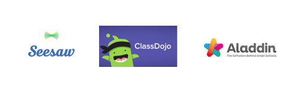 
_School software examples._

I referenced the above apps when considering the structural and UI elements of myPSE.ie.

Rather than doing a deep dive here I thought it would be more efficient to include only aspects of these apps that have influenced or inspired MyPSE.ie's design and functionality directly.

For example:

Class Dojo has an attractive, high contrast, mobile-friendly 
login page which allows users to login based on their 
relationship to the pupil/student.

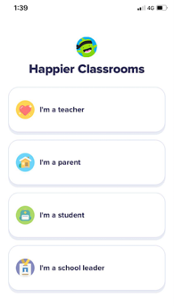 
_Class Dojo Login._

I thought that implementing a similar approach to user login would benefit MyPSE.ie's users, as they would be familiar with the concept of selecting a user role at login. 

Time constraints would restrict this option to a simple dropdown menu but the concept is what I considered to be most important initially.

I loved the subtle alternation of color between records in the esinet system. I thought this was an elegant way to separate entries and I replicated the style in MyPSE.ie's pupil record list template.  

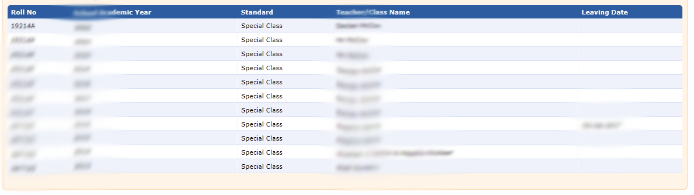 
_Alternating styling for list of records._

‘Aladdin' is a useful communication app that allows schools, teachers and pupils to communicate, share teaching and homework plans, share and log daily attendance as well as many other practical and useful features. This app could potentially be used to send the url of a pupils myPSE.ie passport or even just specific sections of the document to help teachers better understand specific issues relating to the needs of a given pupil. Aladdin's multi-purpose approach to managing daily school life influenced MyPSE's multi-user, multi-layered functionality.

At this stage it's worth pointing out that these apps are indeed multi-dimensional and have communication channels dedicated to informing teachers of SEN pupils needs and issues in real time. So I understand why this might seem confusing to people reading this documentation that are unfamiliar with special education transitions.

What MyPSE.ie offers is information for reference during periods of transition.Passports are by no means the be all and end all of teacher-parent communication. They do however play a vital role in providing a general overview of an SEN pupil at a time when more detailed information is not forthcoming and working relationships and routines have yet to be developed.

Of all of these apps I inspected, Seesaw had the most effect regarding visual style and I based a lot of my UI design choices on its simple, high-contrast approach.

Further into my research, I discovered other applications that heavily influenced my thinking during the initial development of MyPSE.ie. I discuss these in the 'Interviews.' tab below.

    
Interviews/Design Thinking.
     
    

    Working in a special education environment when developing an app for SEN pupils has it's advantages as evidenced earlier in this document by Susan Hynes and in 
    
[other projects](https://github.com/davidcalikes/Marvelous-Matching) 
    I have developed. 

    I was concious however, that working on a project with feedback coming from the teachers and pupils of just one school would be sub-optimal to say the least. 
    
    So I reached out (via telephone) to a local school in my area: St Josephs National School, Kingscourt, and arranged with Christina Meade, a teacher from 'Cairde' (St Joseph's ASD Unit) to arrange a quick telephone survey about MyPSE.ie.

    I consulted with St Mary's Vice Principle Declan McCoy as I formulated questions for Christina. In a somewhat fortunate twist of fate Declan provided me with information that came up during a recent teacher-training course that took place earlier that week. While discussing software in schools during the training a course instructor divulged that 
[Google Workspace For Education](https://edu.google.com/workspace-for-education/editions/education-fundamentals/) has "some integrated passport functionality". 

One of the sticking points that administrators where having difficulty with was the transfer of access priveleges to the assigned teacher and protecting the data of the pupil.

Whilst I was initially disappointed that I had not known about this GWSE feature, I came around to realising that the unique proposition of MyPSE.ie doesn't lie simply in the digitisation of pupil passports and that if anything, for Google to include passport functionality in its suite of education platforms only serves to strengthen the business case for a dedicated app like MyPSE.ie.

I also liked the idea of solving an issue that even Google seemed to be having issues with. Declan was also kind enough to help me formulate some questions for Christina Meade.

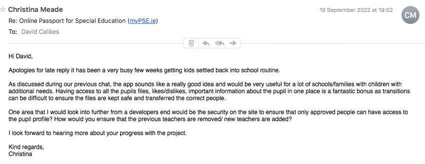 
_Email Response from Christina._

Christina, who ostensibly had just completed the same GDPR training as Declan and the teachers of St Mary's SNS also raised the issue with the transfer/removal of access to teachers.

 

## Research Summary
 

* A digital 'passports' web app has a real world practical use and business use case. 

* The app should be 'standalone' and available for instant, easy adoption by any Irish school.

* The application should use existing, 'real-world' ID numbers to ensure passports and genuine and to future-proof later versions.

* Relevant sections of the app should reflect the design and layout of traditional style passports, and similar education based software to provide users with a sense of familiarity and confidence.

* Users should be instructed to select their user 'role' at login.

* Pupil and parent users should be able to style the text content of their passports to better express the personality and tastes of the pupil.

 

# User Experience Design
 

## User Stories
 

#### __General User Stories__
 

* As a User, I would like the app to be intuitive and easy to navigate in order to access information efficiently.

* As a User I would like to login/logout easily depending on my user role in order to easily access information.

* As a User I want to be Informed when I have submitted a task or action within the app so I can be confident it has been successfully completed.

* As a User I want the app to be easy to read, consistent in design and pleasing to the eye so I will have a positive user experience.

* As a User I would like to access an About page in order to learn more about myPSE.ie

 

#### __User Stories__: *Site Owner*
 

* As a Site Owner, I would like to prevent the ability to create a passport unless a pupils details have been registered by their school in order to prevent misuse of the site.

* As a Site Owner, I would like to limit the number of passports to one passport per pupil in order to prevent misuse of the site and prevent misidentification of the pupil.

* As a Site Owner, I would like to restrict access to passports to authorised and authenticated users only in order to protect pupil data. 

* As a Site Owner, I would like to restrict access to passports based on user role in order to protect pupil data.

* As a Site Owner I would like to automate the transfer of passport teacher permissions in order to protect user data.

* As a Site Owner I would like to automatically delete passports when pupil is no longer enrolled in school in order to protect user data.

 

#### __User Stories__: *Role -- School Admin*
 

* As a School Administrator, I would like to create pupil records in order to facilitate the use of myPSE.ie  passports.

* As a School Administrator, I would like to securely login and out of the application in order to prevent unauthorised access to pupil information. 

* As a School Administrator, I would like to view a list of Enrolled Pupils in order to maintain a record of pupils who can benefit from myPSE.ie.

* As a School Administrator, I would like to update and delete pupil details in order to maintain accurate records.

 

#### __User Stories__: *Role -- Parent*
 

* As a Parent, I would like to create a ‘passport’ for my SEN child to support them during educational transitions.

* As a Parent, I would like to securely login and out of the application in order to prevent unauthorised access to my child’s data.

* As a Parent, I would like to view a list created passports in order to keep track of and access them. 

* As a Parent, I would like to select, edit and delete any Passports I have created in order to maintain accurate data, as well as protect my child’s data.

* As a Parent I would like the User Experience of myPSE.ie to be intuitive and illicit a positive emotional response in order to encourage repeat visits to the app.

* As a Parent, I would like to customise my child’s passport to reflect their personality and tastes in order to provide a more accurate profile of my child. 

* As a Parent, I would like the option to print a ‘printer friendly’ version of my child’s passport in order to provide people outwith the education system with information that will help during a non-educational transition. (Respite facilities, youth clubs, sports teams etc.)

 

#### __User Stories__: *Role -- SEN Pupil*
 

* As an SEN Pupil I would like to create a passport to help others understand my needs, personality, tastes and abilities so they are better informed and equipped to assist me as I transition between Special Educational environments.

* As an SEN Pupil, I would like to securely login and out of the application in order to prevent unauthorised access to my data.

* As an SEN Pupil, I would like the User Experience of myPSE.ie to be intuitive and illicit a positive emotional response in order to encourage repeat visits to the app.

* As an SEN Pupil, I would like to view and edit my passport in order to maintain accurate data across time.

* As an SEN Pupil, I would like myPSE.ie to provide me with the ability to delete my own Passport as is my right.

* As an SEN Pupil, I would like  to customise my passport to reflect my personality and tastes in order to help people understand me.

* As an SEN Pupil, I would like the option to print a ‘printer friendly’ version of my passport in order to provide people outwith the education system with information that will help during a non-educational transition. (Respite facilities, youth clubs, sports teams etc.)

 

#### __User Stories__: *Role -- Teacher*
 

* As an Teacher, I would like to securely login and out of the application in order to prevent unauthorised access to pupil data.

* As a Teacher, I would like to view a list of all passports assigned to my Teacher ID number in order to 
conveniently access their passports.

* As a Teacher, I would like to view the passports of children transitioning into my class in order to prepare supports, staff and educational resources to better facilitate their transition.

 

# Deployment

## Deployment errors and issues

### Security Key.

Whilst setting up the development environment for this project I made the error of accidentally pushing to Github (ergo exposing) the SECURITY_KEY variable within the settings.py file. This variable was part of the code institute's student project template which I used in order to expidiate the initial setup phase of project. I imediately changed this variable and concealed it within the env.py file which was then subsequently added to .gitignore. The CI's variable was never at any point used as a functioning key during the development or deployment of the app.  

