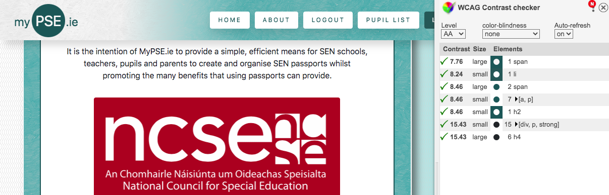
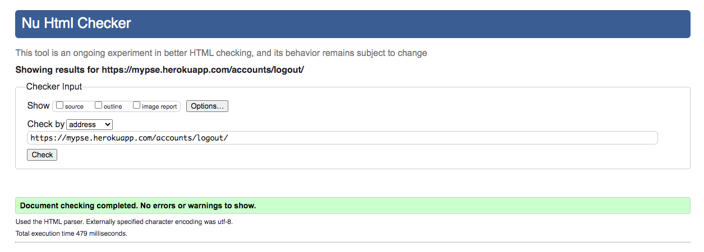
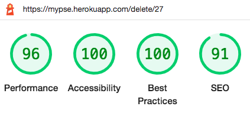
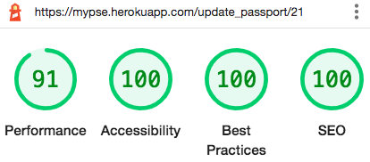
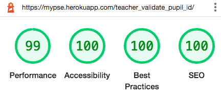
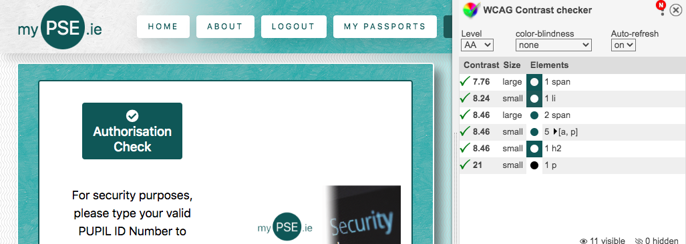

# Testing

 

## Tests during development

### User Story Tests

I tested each user story by adding acceptance criteria to every card of each of the four 'sprint' boards I created as part of the [AGILE](../docs/AGILE.md) planning process. 

No story could move to the 'done' column of each Kanban board unless all tasks had been completed and the criteria had been met.

 
_User Story Screenshot_ 

 
_Kanban Board Screenshot_ 

All of the user story acceptance criteria can be inspected via the four KANBAN boards I have linked to in the [AGILE](../docs/AGILE.md) document.

 

## Bugs & Errors

### Errors found during development

After I imported django allauth I recieved the following error.

 
_ProgrammingError Screenshot_

I searched for, and found a solution to this issue on Stack Overflow.

 
_ProgrammingError Stack Overflow Screenshot_ 

 
_ProgrammingError Bugfix Screenshot_ 

Migrating sites fixed the error.

 

The next error I encountered during development took the form of a 'NoReverseMatch' error. 

 
_NoReverseMatch Error Screenshot_ 

This was simply a typo in the Login Redirect setting.

 
_NoReverseMatch Error Screenshot_ 

I fixed the typo to correct the error.

 

By far the most difficult error I had during development was when attempting to develop the update record view. This is the message that was returned.

 
_AttributeError Screenshot_

This was caused by the incorrect syntax being used in the URL configuration.

I resolved this issue by contacting the Code Institute's tutor support and was given assistance by Ger.

 
_Transcript from Code Institute tutor support_

I was somewhat heartend to hear that this problem was an unusual issue and it took an experienced developer a bit of time to reach a resolution.
Because of the nature and scope of this project, I was less concerned about trying to solve every issue by myself. If anything feel I probably spent too long working on this error before asking for help. It is a trait I will concentrate on as I continue my journey as a junior developer. 

 

Another problem was encountered when, the pupil record template returned this 404 error.
 
_404 Error Screenshot_ 

I examined the code block and it seemed to be because the pupil ID number began with zero and the database was dropping the leading zero.

 
_404 Bug Screenshot_ 

 
_404 Pupil ID begins with zero_

I fixed this bug by re-configuring the fields REGEX validator to only accept digits 1-9 for the first digit of a pupil ID number.

 
_404 Bugfix Screenshot_ 

I then used the Admin panel to remove any instances that began with zero.

 

I recieved this NameError when developing the MVT relationships to access passports.

 
_NameError Passport Bug Screenshot_

This error was caused by a missing module at the top of views.py

 
_NameError Passport Bugfix Screenshot_

I fixed this by importing the passport model at the top of views.py

 

I found and fixed a bug caused by a typo in the passport detail template. A miss-typed field name was the cause of the missing text.

 
_Typo Bug Screenshot_ 

 
_Typo Bugfix Screenshot_ 

 

The next 404 error was trying returned when I tried to access a pupil passport.

 
_404 Passpory Bug Screenshot_ 

This error was caused by a missing curly brace.

 
_404 Passport Bug Screenshot_ 

I fixed this by adding the missing symbol.

## Outstanding/Unfixed Bugs

There is currently a bug that occurs when submitting a passport via the passport form page. 

 
_Bug Form Submission Error_

The bug occurs when the user selects an image for upload and then sumbits a form that contains an error in another field. This causes the selected image to require re-selection after fixing the form field error and results in a negative experience for the user. 

 
_Bug Form Submission Error_

I have eleborated on this issue and the short term measures I have taken to address it in the practical testing section later in this document. 

Apart from this bug there are no other known bugs at present.

 

## Manual Testing

Each page, feature and link of the application has been tested.
I have used dropdown menus for each page to make the documentation more human readable.

Home Page Testing
 

Each link of the Home Page was tested and was marked 'pass' when the following expected behaviour was produced.

* Login Redirect -- The user is directed to the correct page depending on the users authentication status upon login or when the login links in the homepage cards are clicked.

* Can Access About Page -- The user can access the about page from the home page.

* Can Access Login Page -- The user can access the login page via the nav bar.

* Can Access Logout Page -- The user can access the logout page via the nav bar.

* Card Links -- The user is redirected to the login page if not authenticated or redirected to correct landing page for user type if authenticated when login card link is clicked. The user can access the about page from the about card link.

* Can open footer links -- Footer links open in a new tab.

 

Below is the testing table for the home page.

| Logged in as  | Login Redirect             | Can Access About Page | Can Access Login | Can Access Logout | Can Access Register  | Card Links                   | Can open Footer Links (new tab) |
|---------------|----------------------------|-----------------------|------------------|-------------------|----------------------|------------------------------|---------------------------------|
| Not Logged In | N/A                        | pass                  | yes/pass         | no/pass           | yes/pass             | login-login-about/pass       | yes/pass                        |
| Admin         | home                       | pass                  | no/pass          | yes/pass          | no/pass              | home-home-about/pass         | yes/pass                        |
| School        | Enrolled Pupil List/pass   | pass                  | no/pass          | yes/pass          | no/pass              | redirect-redirect-about/pass | yes/pass                        |
| Pupil         | Pupil Check/pass           | pass                  | no/pass          | yes/pass          | no/pass              | redirect-redirect-about/pass | yes/pass                        |
| Parent        | Passport List/pass         | pass                  | no/pass          | yes/pass          | no/pass              | redirect-redirect-about/pass | yes/pass                        |
| Teacher       | Teacher Passport List/pass | pass                  | no/pass          | yes/pass          | no/pass              | redirect-redirect-about/pass | yes/pass                        |

 

Home page validator testing.

The Home page was passed through the W3C HTML Validator and returned no errors

 
_W3C HTML Validator Testing Screenshot_ 

The Home page was passed through the Jigsaw CSS validator and returned no errors.

 
_W3C Jigsaw CSS Validator Testing Screenshot_

The Home page was passed through the WCAG Color contrast checker and returned no contrast errors.

 
_WCAG Validator Testing Screenshot_

The Home Page was passed through Lighthouse and returned the following performance results:

 
_Desktop Lighthouse Performance Testing Screenshot_

 
_Mobile Lighthouse Performance Testing Screenshot_

In future versions of the app I hope to significantly improve mobile performance.
 

About Page Testing
 

Each link of the About Page was tested and was marked 'pass' when the following expected behaviour was produced.

* Can Access Home Page -- The user can access the home page from the about page.

* Can Access Learn More Page -- The user can access the learn more page from the about page.

* Can Access Login Page -- The user can access the login page via the nav bar.

* Can Access Logout Page -- The user can access the logout page via the nav bar.

* Can Download User Guides -- The user can download any of the user guides from the about page. (opens new tab)

* Can Download Samples -- The user can download any of the sample passports frtom the about page. (opens new tab)

* Can open footer links -- Footer links open in a new tab.

 

Below is the testing table for the about page.

| Logged in as  | Can Access Home Page | Can Access Learn More Page | Can Access Login | Can Access Logout | Can Access Register  | Can Download User Guide (new tab) | Can Download Samples (new tab) | Can Open Footer Links (new tab) |
|---------------|----------------------|----------------------------|------------------|-------------------|----------------------|-----------------------------------|--------------------------------|---------------------------------|
| Not Logged In | Pass                 | pass                       | yes/pass         | no/pass           | yes/pass             | Pupil/Parent/Teacher/School/Pass  | Sample One/SampleTwo/Pass      | yes/pass                        |
| Admin         | Pass                 | pass                       | no/pass          | yes/pass          | no/pass              | Pupil/Parent/Teacher/School/Pass  | Sample One/SampleTwo/Pass      | yes/pass                        |
| School        | Pass                 | pass                       | no/pass          | yes/pass          | no/pass              | Pupil/Parent/Teacher/School/Pass  | Sample One/SampleTwo/Pass      | yes/pass                        |
| Pupil         | Pass                 | pass                       | no/pass          | yes/pass          | no/pass              | Pupil/Parent/Teacher/School/Pass  | Sample One/SampleTwo/Pass      | yes/pass                        |
| Parent        | Pass                 | pass                       | no/pass          | yes/pass          | no/pass              | Pupil/Parent/Teacher/School/Pass  | Sample One/SampleTwo/Pass      | yes/pass                        |
| Teacher       | Pass                 | pass                       | no/pass          | yes/pass          | no/pass              | Pupil/Parent/Teacher/School/Pass  | Sample One/SampleTwo/Pass      | yes/pass                        |

About page validator testing.

The About page was passed through the W3C HTML Validator and returned no errors

 
_W3C HTML Validator Testing Screenshot_ 

The About page was passed through the Jigsaw CSS validator and returned no errors.

 
_W3C Jigsaw CSS Validator Testing Screenshot_

The About page was passed through the WCAG Color contrast checker and returned no contrast errors.

 
_WCAG Validator Testing Screenshot_

The About Page was passed through Lighthouse and returned the following performance results:

 
_Desktop Lighthouse Performance Testing Screenshot_

 
_Mobile Lighthouse Performance Testing Screenshot_

In future versions of the app I hope to significantly improve mobile performance.
 

Learn More Page Testing
 

Each link of the Learn More Page was tested and was marked 'pass' when the following expected behaviour was produced.
 

* Can Access Home Page -- The user can access the home page from the Learn More Page. 

* Can Access About Page (both links)  -- The user can access the about page from the Learn More Page.

* Can Access Logout Page - user can access Logout page from the Learn More Page.

* Can Access User list - user can access list page dedicated to their user type.

* Can open NCSE link - user can open NCSE link in new tab.

* Can open footer links -- Footer links open in a new tab.

Below is the testing table for the Learn More page.

| Logged in as  | Can Logout | Can Access Home Page | Can Access About Page (both links) | Can Open NCSE Link (new tab) | Can Access User List | Can Open Footer Links (new tab) |
|---------------|------------|----------------------|------------------------------------|------------------------------|----------------------|---------------------------------|
| Not Logged In | n/a        | yes/pass             | yes/pass                           | yes/pass                     | n/a                  | yes/pass                        |
| Admin         | yes/pass   | yes/pass             | yes/pass                           | yes/pass                     | no/pass              | yes/pass                        |
| School        | yes/pass   | yes/pass             | yes/pass                           | yes/pass                     | yes/pass             | yes/pass                        |
| Pupil         | yes/pass   | yes/pass             | yes/pass                           | yes/pass                     | yes/pass             | yes/pass                        |
| Parent        | yes/pass   | yes/pass             | yes/pass                           | yes/pass                     | yes/pass             | yes/pass                        |
| Teacher       | yes/pass   | yes/pass             | yes/pass                           | yes/pass                     | yes/pass             | yes/pass                        |

 
The Learn More Page validator testing.

The Learn More page source code. was passed through the W3C HTML Validator and returned no errors.

 
_W3C HTML Validator Testing Screenshot_ 

The Learn More page was passed through the Jigsaw CSS validator and returned no errors.

 
_W3C Jigsaw CSS Validator Testing Screenshot_

The Learn More page was passed through the WCAG Color contrast checker and returned no contrast errors.

 
_WCAG Validator Testing Screenshot_

The Learn More page was passed through Lighthouse and returned the following performance results:

 
_Desktop Lighthouse Performance Testing Screenshot_

 
_Mobile Lighthouse Performance Testing Screenshot_
 

Login Page Testing
 

Each link of the Login Page was tested and was marked 'pass' when the following expected behaviour was produced. A created user from every user type was logged in succesfully.
 

* Can Access Home Page -- The user can access the home page from the login page.

* Can Access About Page -- The user can access the about page from the login page.

* Can Access Register Page -- The user can access the register page via the nav bar or the signup link.

* Can login as Admin -- Admin user can login

* Can login as School -- School user can login

* Can login as Pupil -- Pupil user can login

* Can login as Parent -- Parent user can login

* Can login as Teacher -- Teacher user can login

* Can open footer links -- Footer links open in a new tab.

 

Below is the testing table for the Login page.

| Logged In As  | Can Access Home Page | Can Access About Page | Can Login As Admin | Can Login As School | Can Login As Pupil  | Can Login As Parent | Can Login As Teacher | Can Access Register (both links) | Can Open Footer Links (new tab) |
|---------------|----------------------|-----------------------|--------------------|---------------------|---------------------|---------------------|----------------------|----------------------------------|---------------------------------|
| Not Logged In | yes/pass             | yes/pass              | yes/pass           | yes/pass            | yes/pass            | yes/pass            | Yes Pass             | Yes/Pass                         | yes/pass                        |

Login page validator testing.

The Login page was passed through the W3C HTML Validator and returned no errors

 
_W3C HTML Validator Testing Screenshot_ 

The Login page was passed through the Jigsaw CSS validator and returned no errors.

 
_W3C Jigsaw CSS Validator Testing Screenshot_

The Login page was passed through the WCAG Color contrast checker and returned no contrast errors.

 
_WCAG Validator Testing Screenshot_

The Login Page was passed through Lighthouse and returned the following performance results:

 
_Desktop Lighthouse Performance Testing Screenshot_

 
_Mobile Lighthouse Performance Testing Screenshot_
 

Logout Page Testing
 

Each link of the Logout Page was tested and was marked 'pass' when the following expected behaviour was produced. A created user from every user type was logged out succesfully.
 

* Can Access Home Page -- The user can access the home page from the logout page.

* Can Access About Page -- The user can access the about page from the logout page.

* Can logout as Admin -- Admin user can logout.

* Can logout as School -- School user can logout.

* Can logout as Pupil -- Pupil user can logout.

* Can logout as Parent -- Parent user can logout.

* Can logout as Teacher -- Teacher user can logout.

* Can Access user list - user can access list page dedicated to their user type.

* Can open footer links -- Footer links open in a new tab.

 

Below is the testing table for the Logout page.

| Logged in as  | Can Logout | Can Access Home Page | Can Access About Page | Can Access User List | Can Open Footer Links (new tab) |
|---------------|------------|----------------------|-----------------------|----------------------|---------------------------------|
| Not Logged In | n/a        | n/a                  | n/a                   | n/a                  | yes/pass                        |
| Admin         | pass       | pass                 | pass                  | no/pass              | yes/pass                        |
| School        | pass       | pass                 | pass                  | yes/pass             | yes/pass                        |
| Pupil         | pass       | pass                 | pass                  | yes/pass             | yes/pass                        |
| Parent        | pass       | pass                 | pass                  | yes/pass             | yes/pass                        |
| Teacher       | pass       | pass                 | pass                  | yes/pass             | yes/pass                        |

 

Logout page validator testing.

The Logout page was passed through the W3C HTML Validator and returned no errors

 
_W3C HTML Validator Testing Screenshot_ 

The Logout page was passed through the Jigsaw CSS validator and returned no errors.

 
_W3C Jigsaw CSS Validator Testing Screenshot_

The Logout page was passed through the WCAG Color contrast checker and returned no contrast errors.

 
_WCAG Validator Testing Screenshot_

The Logout Page was passed through Lighthouse and returned the following performance results:

 
_Desktop Lighthouse Performance Testing Screenshot_

 
_Mobile Lighthouse Performance Testing Screenshot_
 

Registration Page Testing
 

Each link of the Registration Page was tested and was marked 'pass' when the following expected behaviour was produced. A user of every user type was registered succesfully.
 

* Can Access Home Page -- The user can access the home page from the registration page.

* Can Access About Page (both links) -- The user can access the about page from the registration page.

* Can Access Login Page (both links) -- The user can access the login page from the registration page.

* Can register as School -- School user can register.

* Can register as Pupil -- Pupil user can register.

* Can register as Parent -- Parent user can register.

* Can register as Teacher -- Teacher user can register.

* User is redirected on login - user is redirected to list page dedicated to their user type.

Below is the testing table for the Registration page.

*Can open footer links -- Footer links open in a new tab.
| Logged In As  | Can Access Home Page | Can Access About Page (both links) | Can Register As School | Can Register As Pupil  | Can Register As Parent | Can Register As Teacher | Can Access Login (both links) | Can Open Footer Links (new tab) |
|---------------|----------------------|------------------------------------|------------------------|------------------------|------------------------|-------------------------|-------------------------------|---------------------------------|
| Not Logged In | yes/pass             | yes/pass                           | yes/pass               | yes/pass               | yes/pass               | Yes Pass                | Yes/Pass                      | yes/pass                        |

 

Rsgistration page validator testing.

The Registration page was passed through the W3C HTML Validator and returned no errors

 
_W3C HTML Validator Testing Screenshot_ 

The Registration page was passed through the Jigsaw CSS validator and returned no errors.

 
_W3C Jigsaw CSS Validator Testing Screenshot_

The Registration page was passed through the WCAG Color contrast checker and returned no contrast errors.

 
_WCAG Validator Testing Screenshot_

The Registration Page was passed through Lighthouse and returned the following performance results:

 
_Desktop Lighthouse Performance Testing Screenshot_

 
_Mobile Lighthouse Performance Testing Screenshot_
 

404 Error Page Testing
 

Each link of the 404 Error Page was tested and was marked 'pass' when the following expected behaviour was produced.
 

* Can Access Home Page (both links) -- The user can access the home page from the 404 error page

* Can Access About Page  -- The user can access the about page from the 404 error page

* Can Access Login Page (if logged out)  -- The user can access the login page from the 404 error page

* Can Access Logout Page - user can access Logout page from the 404 error page

* Can Access Registration Page - user can access registration page from the 404 error page

* Can Access user list - user can access list page dedicated to their user type.

* Can open footer links -- Footer links open in a new tab.

Below is the testing table for the 404 Error page.

| User Status | Can Access Home Page (both links) | Can Access About Page | Can Access Login Page (if logged out)  | Can Access Logout Page (if logged in) | Can Access Registration Page (If Logged Out) | Can Access User List (if logged in | Can Open Footer Links (new tab) |
|-------------|-----------------------------------|-----------------------|---------------------------------------|------------------------------------|----------------------------------------------|------------------------------------|---------------------------------|
| Any         | yes/pass                          | yes/pass              | yes/pass                              | yes/pass                           | yes/pass                                     | Yes/Pass                           | yes/pass                        |

 

404 error page validator testing.

The 404 error page was passed through the W3C HTML Validator and returned no errors

 
_W3C HTML Validator Testing Screenshot_ 

The 404 error page was passed through the Jigsaw CSS validator and returned no errors.

 
_W3C Jigsaw CSS Validator Testing Screenshot_

The 404 error page was passed through the WCAG Color contrast checker and returned no contrast errors.

 
_WCAG Validator Testing Screenshot_

The 404 error page was passed through Lighthouse and returned the following performance results:

 
_Desktop Lighthouse Performance Testing Screenshot_

 
_Mobile Lighthouse Performance Testing Screenshot_
 

500 Error Page Testing
 

Each link of the 500 Error Page Testing was tested and was marked 'pass' when the following expected behaviour was produced.
 

* Can Access Home Page (both links) -- The user can access the home page from the 500 error page

* Can Access About Page  -- The user can access the about page from the 500 error page

* Can Access Login Page (if logged out)  -- The user can access the login page from the 500 error page

* Can Access Logout Page - user can access Logout page from the 500 error page

* Can Access Registration Page - user can access registration page from the 500 error page

* Can Access user list - user can access list page dedicated to their user type.

* Can open footer links -- Footer links open in a new tab.

Below is the testing table for the 500 Error page.

| User Status | Can Access Home Page (both links) | Can Access About Page | Can Access Login Page (if logged out)  | Can Access Logout Page (if logged in) | Can Access Registration Page (If Logged Out) | Can Access User List (if logged in | Can Open Footer Links (new tab) |
|-------------|-----------------------------------|-----------------------|---------------------------------------|------------------------------------|----------------------------------------------|------------------------------------|---------------------------------|
| Any         | yes/pass                          | yes/pass              | yes/pass                              | yes/pass                           | yes/pass                                     | Yes/Pass                           | yes/pass                        |

 

500 error page validator testing.

The 500 error page was passed through the W3C HTML Validator and returned no errors

 
_W3C HTML Validator Testing Screenshot_ 

The 500 error page was passed through the Jigsaw CSS validator and returned no errors.

 
_W3C Jigsaw CSS Validator Testing Screenshot_

The 500 error page was passed through the WCAG Color contrast checker and returned no contrast errors.

 
_WCAG Validator Testing Screenshot_

The 500 error page was passed through Lighthouse and returned the following performance results:

 
_Desktop Lighthouse Performance Testing Screenshot_

 
_Mobile Lighthouse Performance Testing Screenshot_
 

Delete Passport Page Testing
 

Each link of the Delete Passport Page was tested and was marked 'pass' when the following expected behaviour was produced.
 

* Can Access Home Page -- The user can access the home page from the Delete Passport page

* Can Access About Page  -- The user can access the about page from the Delete Passport page

* Can Access Logout Page - user can access Logout page from the Delete Passport page

* Can Access user list - user can access list page dedicated to their user type.

* Can Delete Passport - user can delete passport and is returned to list view.

* Can return to passport - user can go back to passport without deleting passport by pressing go back.

* Can open footer links -- Footer links open in a new tab.

Below is the testing table for the Delete Passport page.

| User Status  | Can Access Home Page (both links) | Can Access About Page | Can Access Login Page (if logged out)  | Can Access User List (if logged in | Can Delete Passport | Can Return To Passport | Can Open Footer Links (new tab) |
|--------------|-----------------------------------|-----------------------|---------------------------------------|------------------------------------|---------------------|------------------------|---------------------------------|
| Pupil/Parent | yes/pass                          | yes/pass              | yes/pass                              | Yes/Pass                           | yes/pass            | yes/pass               | yes/pass                        |

 

Delete Passport page validator testing.

Because The Delete Passport page cannot be accessed by W3c I passed the template source code through the W3C HTML Validator and it returned an error

 
_W3C HTML Validator Testing Screenshot_ 

I added a hashtag to the empty form attribute.

 
_W3C HTML Validator Testing Screenshot_ 

This resolved the error.

 
_W3C HTML Validator Testing Screenshot_ 

The CSS file for the Delete Passport page (and all other pages of the site) passes W3C Jigsaw validation with no errors.

 
_W3C Jigsaw CSS Validator Testing Screenshot_

The Delete Passport page was passed through the WCAG Color contrast checker and returned no contrast errors.

 
_WCAG Validator Testing Screenshot_

The Delete Passport page was passed through Lighthouse and returned the following performance results:

 
_Desktop Lighthouse Performance Testing Screenshot_

 
_Mobile Lighthouse Performance Testing Screenshot_

The SEO test score was lower here as the href has been left blank.
 

Delete Pupil Record Page Testing
 

Each link of the Delete Pupil Record Page was tested and was marked 'pass' when the following expected behaviour was produced.
 

* Can Access Home Page -- The user can access the home page from the Delete Pupil Record page.

* Can Access About Page  -- The user can access the about page from the Delete Pupil Record page.

* Can Access Logout Page - user can access Logout page from the Delete Pupil Record page.

* Can Access User list - user can access list page dedicated to their user type.

* Can Delete Pupil record - user can delete pupil record and is returned to list view.

* Can return to Pupil Record - user can go back to pupil record without deleting pupil record by pressing go back.

* Can open footer links -- Footer links open in a new tab.

Below is the testing table for the Delete Pupil Record page.

| User Status  | Can Access Home Page (both links) | Can Access About Page | Can Access Login Page (if logged out)  | Can Access User List (if logged in | Can Delete Passport | Can Return To Passport | Can Open Footer Links (new tab) |
|--------------|-----------------------------------|-----------------------|---------------------------------------|------------------------------------|---------------------|------------------------|---------------------------------|
| School Admin | yes/pass                          | yes/pass              | yes/pass                              | Yes/Pass                           | yes/pass            | yes/pass               | yes/pass                        |

 

Delete Pupil Record page. validator testing.

The Delete Pupil Record page source code. was passed through the W3C HTML Validator and returned no errors.

 
_W3C HTML Validator Testing Screenshot_ 

The CSS file for the Delete Pupil Record page (and all other pages of the site) passes W3C Jigsaw validation with no errors.

 
_W3C Jigsaw CSS Validator Testing Screenshot_

The Delete Pupil Record page was passed through the WCAG Color contrast checker and returned no contrast errors.

 
_WCAG Validator Testing Screenshot_

The Delete Pupil Record page was passed through Lighthouse and returned the following performance results:

 
_Desktop Lighthouse Performance Testing Screenshot_

 
_Mobile Lighthouse Performance Testing Screenshot_

The SEO test score was lower here as the href attribute has been left blank.
 

Enrolled Pupil List Page Testing
 

Each link of the Enrolled Pupil List Page was tested and was marked 'pass' when the following expected behaviour was produced.
 

* Can Access Home Page -- The user can access the home page from the Enrolled Pupil List page. 

* Can Access About Page  -- The user can access the about page from the Enrolled Pupil List page.

* Can Access Logout Page - user can access Logout page from the Enrolled Pupil List page.

* Can Access User list - user can access list page dedicated to their user type.

* Can Access Pupil record - user can access pupil record via link.

* Can Download Printable PDF  - user can download form via link.

* Can open footer links -- Footer links open in a new tab.

Below is the testing table for the Enrolled Pupil List page.

| Logged in as | Can Access Logout | Can Access Home Page | Can Access About Page | Can Access User List | Can Access Pupil Record | Can Download PDF | Can Open Footer Links (new tab) |
|--------------|-------------------|----------------------|-----------------------|----------------------|-------------------------|------------------|---------------------------------|
| School Admin | yes/pass          | yes/pass             | yes/pass              | yes/pass             | yes/pass                | yes/pass         | yes/pass                        |

 

The Enrolled Pupil List validator testing.

The Enrolled Pupil List page source code. was passed through the W3C HTML Validator and returned no errors.

 
_W3C HTML Validator Testing Screenshot_ 

The CSS file for the Enrolled Pupil List page (and all other pages of the site) passes W3C Jigsaw validation with no errors.

 
_W3C Jigsaw CSS Validator Testing Screenshot_

The Enrolled Pupil List page was passed through the WCAG Color contrast checker and returned no contrast errors.

 
_WCAG Validator Testing Screenshot_

The Enrolled Pupil List page was passed through Lighthouse and returned the following performance results:

 
_Desktop Lighthouse Performance Testing Screenshot_

The SEO was affected by a poor link decription.

 
_Desktop Lighthouse Performance Testing Screenshot_

I changed the link description to the following.

 
_Desktop Lighthouse Performance Testing Screenshot_

The SEO was optimal after I fixed the error.

 
_Mobile Lighthouse Performance Testing Screenshot_

 

Enrolled Pupil Record Page Testing
 

Each link of the Enrolled Pupil Record Page was tested and was marked 'pass' when the following expected behaviour was produced.
 

* Can Access Home Page -- The user can access the home page from the Enrolled Pupil Record Page. 

* Can Access About Page  -- The user can access the about page from the Enrolled Pupil Record Page.

* Can Access Logout Page - user can access Logout page from the Enrolled Pupil Record Page.

* Can Access User list - user can access list page dedicated to their user type.

* Can Access Edit Pupil record - user can access edit pupil record page via link.

* Can Access Delete Pupil record - user can access delete pupil record page via link.

* Can open footer links -- Footer links open in a new tab.

Below is the testing table for the Enrolled Pupil Record page.

| Logged in as | Can Access Logout | Can Access Home Page | Can Access About Page | Can Access User List | Can Access Edit Pupil Record | Can Access Delete Record Page | Can Open Footer Links (new tab) |
|--------------|-------------------|----------------------|-----------------------|----------------------|------------------------------|-------------------------------|---------------------------------|
| School Admin | yes/pass          | yes/pass             | yes/pass              | yes/pass             | yes/pass                     | yes/pass                      | yes/pass                        |

 
The Enrolled Pupil Record Page validator testing.

The Enrolled Pupil Record page source code. was passed through the W3C HTML Validator and returned no errors.

 
_W3C HTML Validator Testing Screenshot_ 

The CSS file for the Pupil Record page (and all other pages of the site) passes W3C Jigsaw validation with no errors.

 
_W3C Jigsaw CSS Validator Testing Screenshot_

The Enrolled Pupil Record page was passed through the WCAG Color contrast checker and returned no contrast errors.

 
_WCAG Validator Testing Screenshot_

The Enrolled Pupil Record page was passed through Lighthouse and returned the following performance results:

 
_Desktop Lighthouse Performance Testing Screenshot_

 
_Mobile Lighthouse Performance Testing Screenshot_

 

Add Pupil Record Page Testing
 

Each link of the Add Pupil Record Page was tested and was marked 'pass' when the following expected behaviour was produced.
 

* Can Access Home Page -- The user can access the home page from the Add Pupil Record Page. 

* Can Access About Page  -- The user can access the about page from the Add Pupil Record Page.

* Can Access Logout Page - user can access Logout page from the Add Pupil Record Page.

* Can Access User list - user can access list page dedicated to their user type.

* Can Submit Pupil record - user can submit pupil record via form.

* Can Cancel without Submit - user can cancel without submitting the form and is returned to the Pupil List Page.

* Can open footer links -- Footer links open in a new tab.

Below is the testing table for the Add Pupil Record page.

| Logged in as | Can Access Logout | Can Access Home Page | Can Access About Page | Can Access User List | Can Access Submit Pupil Record | Can Cancel without Sumbit | Can Open Footer Links (new tab) |
|--------------|-------------------|----------------------|-----------------------|----------------------|--------------------------------|---------------------------|---------------------------------|
| School Admin | yes/pass          | yes/pass             | yes/pass              | yes/pass             | yes/pass                       | yes/pass                  | yes/pass                        |

The Add Pupil Record Page validator testing.

The Add Pupil Record page source code. was passed through the W3C HTML Validator and returned no errors.

 
_W3C HTML Validator Testing Screenshot_ 

The CSS file for the Add Pupil Record page (and all other pages of the site) passes W3C Jigsaw validation with no errors.

 
_W3C Jigsaw CSS Validator Testing Screenshot_

The Add Pupil Record page was passed through the WCAG Color contrast checker and returned no contrast errors.

 
_WCAG Validator Testing Screenshot_

The Add Pupil Record page was passed through Lighthouse and returned the following performance results:

 
_Desktop Lighthouse Performance Testing Screenshot_

 
_Mobile Lighthouse Performance Testing Screenshot_
 

Passport List Page Testing
 

Each link of the Passport List Page was tested and was marked 'pass' when the following expected behaviour was produced.
 

* Can Access Home Page -- The user can access the home page from the Passport List Page. 

* Can Access About Page  -- The user can access the about page from the Passport List Page.

* Can Access Logout Page - user can access Logout page from the Passport List Page.

* Can Access User list - user can access list page dedicated to their user type.

* Can Access Passports - user can access any passports they have created.

* Can Access Passports form - user can access passport form page.

* Can open footer links -- Footer links open in a new tab.

Below is the testing table for the Passport List page.

| Logged in as                   | Can Access Logout | Can Access Home Page | Can Access About Page | Can Access User List | Can Access Passport(s) | Can Access Passport Form Page | Can Open Footer Links (new tab) |
|--------------------------------|-------------------|----------------------|-----------------------|----------------------|------------------------|-------------------------------|---------------------------------|
| Parent                         | yes/pass          | yes/pass             | yes/pass              | yes/pass             | yes/pass               | yes/pass                      | yes/pass                        |
| Pupil(redirected after sumbit) | yes/pass          | yes/pass             | yes/pass              | yes/pass             | yes/pass               | no/pass                       | yes/pass                        |

 
The Passport List Page validator testing.

The Passport List page source code. was passed through the W3C HTML Validator and returned no errors.

 
_W3C HTML Validator Testing Screenshot_ 

The CSS file for the Passport List page (and all other pages of the site) passes W3C Jigsaw validation with no errors.

 
_W3C Jigsaw CSS Validator Testing Screenshot_

The Passport List page was passed through the WCAG Color contrast checker and returned no contrast errors.

 
_WCAG Validator Testing Screenshot_

The Passport List page was passed through Lighthouse and returned the following performance results:

 
_Desktop Lighthouse Performance Testing Screenshot_

 
_Mobile Lighthouse Performance Testing Screenshot_
 

Passport Detail Page Testing
 

Each link of the Passport Detail Page was tested and was marked 'pass' when the following expected behaviour was produced.
 

* Can Access Home Page -- The user can access the home page from the Passport Detail Page. 

* Can Access About Page  -- The user can access the about page from the Passport Detail Page.

* Can Access Logout Page - user can access Logout page from the Passport Detail Page.

* Can Access User list - user can access list page dedicated to their user type.

* Can Access Edit Passport Form Page - user can access the edit passport form page from the passport detail page.

* Can Access delete passport page - user can access the delete passport form page from the passport detail page.

* Can open footer links -- Footer links open in a new tab.

Below is the testing table for the Passport List page.

| Logged in as | Can Access Logout | Can Access Home Page | Can Access About Page | Can Access User List | Can Access Edit Passport Form page | Can Access Delete Passport Form Page | Can Open Footer Links (new tab) |
|--------------|-------------------|----------------------|-----------------------|----------------------|------------------------------------|--------------------------------------|---------------------------------|
| Parent       | yes/pass          | yes/pass             | yes/pass              | yes/pass             | yes/pass                           | yes/pass                             | yes/pass                        |
| Pupil        | yes/pass          | yes/pass             | yes/pass              | yes/pass             | yes/pass                           | yes/pass                             | yes/pass                        |

 
The Passport Detail Page validator testing.
 

The Passport Detail page source code. was passed through the W3C HTML Validator and multiple errors were returned.

 
_W3C HTML Validator Testing Screenshot_ 

Having placed a body tag inside a template that the extends base.html template, I had a returned a document with multiple body tags.
I resolved this issue by removing the body tag from the passport detail template and calling the applyID script via an onclick event instead.

 
_W3C HTML Validator Error Fix_ 

 
_W3C HTML Validator Error Fix_ 

Another HTML Validation Error I found was caused by the rendering of Summernote text content. Summernote was adding an extra closing pararaph tag to each text field submitted. 

 
_Summernote Rendering HTML Validator Error_ 

I decided I could leave this problem for now, as the error is not causing any issues with the rendering of the page or visible to the user in any way. I will implement a solution as soon as one becomes available.

The CSS file for the Passport Detail page (and all other pages of the site) passes W3C Jigsaw validation with no errors.

 
_W3C Jigsaw CSS Validator Testing Screenshot_

The Passport Detail page was passed through the WCAG Color contrast checker and returned no contrast errors.

 
_WCAG Validator Testing Screenshot_

Bacause The Passport Detail page is restricted, I had to temporarily remove HTTP referer conditions before it was passed through Lighthouse and returned the following performance results:

 
_Desktop Lighthouse Performance Testing Screenshot_

 
_Mobile Lighthouse Performance Testing Screenshot_
 

Passport Form Page Testing
 

Each link of the Passport Form Page was tested and was marked 'pass' when the following expected behaviour was produced.
 

* Can Access Home Page -- The user can access the home page from the Passport Form Page. 

* Can Access About Page  -- The user can access the about page from the Passport Form Page.

* Can Access Logout Page - user can access Logout page from the Passport Form Page.

* Can Access User list - user can access list page dedicated to their user type.

* Can Submit Passport Form - user can submit a passport they have created.

* Loading Modal Displayed - The loading modal displays upon form submission.

* Can open footer links -- Footer links open in a new tab.

Below is the testing table for the Passport List page.

| Logged in as | Can Access Logout | Can Access Home Page | Can Access About Page | Can Access User List | Can Submit Passport Form | Loading Modal Displayed | Can Open Footer Links (new tab) |
|--------------|-------------------|----------------------|-----------------------|----------------------|--------------------------|-------------------------|---------------------------------|
| Parent       | yes/pass          | yes/pass             | yes/pass              | yes/pass             | yes/pass                 | yes/pass                | yes/pass                        |
| Pupil        | yes/pass          | yes/pass             | yes/pass              | yes/pass             | yes/pass                 | yes/pass                | yes/pass                        |

 
The Passport Form Page validator testing.

The Passport Form page source code. was passed through the W3C HTML Validator and returned multiple errors.

 
_W3C HTML Validator Testing Screenshot_ 

There are nine issues outstanding that repeat for every summernote text input field. I have searched for a solution to this
problem but none was forthcoming. I discovered it is a known issue using summernote with Django. Because styling the text 
is such a key part of providing a positive user experience to pupil and parent users, I have decided to leave these errors as
they do not impact the user and removing summernote would drastically reduce the user experience and functionality of MyPSE.ie.

I will continue to look for a solution to this issue.  

The CSS file for the Passport Form page (and all other pages of the site) passes W3C Jigsaw validation with no errors.

 
_W3C Jigsaw CSS Validator Testing Screenshot_

The Passport Form page was passed through the WCAG Color contrast checker and returned no contrast errors.

 
_WCAG Validator Testing Screenshot_

The Passport Form page was passed through Lighthouse and returned the following performance results:

 
_Desktop Lighthouse Performance Testing Screenshot_

 
_Mobile Lighthouse Performance Testing Screenshot_
 

Pupil Check Page Testing
 

Each link of the Pupil Check Page was tested and was marked 'pass' when the following expected behaviour was produced.
 

* Can Access Home Page -- The user can access the home page from the Pupil Check Page. 

* Can Access About Page  -- The user can access the about page from the Pupil Check Page.

* Can Access Logout Page - user can access Logout page from the Pupil Check Page.

* Can Access User list - user can access list page dedicated to their user type.

* Can Access Passport - user can read a passport they have created.

* Can Add Passport (if created) - pupil user cannot create a passport if they already have one.

* Can Add passport (if not created) - pupil user can create passport if they don't already have one.

* Can open footer links -- Footer links open in a new tab.

Below is the testing table for the Pupil Check page.

| Logged in as | Can Access Logout | Can Access Home Page | Can Access About Page | Can Access User List | Can Access Passport (if created) | Can Add passport (if created) | Can Add Passport (if not Created) | Can Open Footer Links (new tab) |
|--------------|-------------------|----------------------|-----------------------|----------------------|----------------------------------|-------------------------------|-----------------------------------|---------------------------------|
| Pupil        | yes/pass          | yes/pass             | yes/pass              | yes/pass             | yes/pass                         | no/pass                       | yes/pass                          | yes/pass                        |

 
The Pupil Check Page validator testing.

The Pupil Check page source code. was passed through the W3C HTML Validator and returned no errors.

 
_W3C HTML Validator Testing Screenshot_  

The CSS file for the Pupil Check page (and all other pages of the site) passes W3C Jigsaw validation with no errors.

 
_W3C Jigsaw CSS Validator Testing Screenshot_

The Pupil Check page was passed through the WCAG Color contrast checker and returned no contrast errors.

 
_WCAG Validator Testing Screenshot_

The Pupil Check page was passed through Lighthouse and returned the following performance results:

 
_Desktop Lighthouse Performance Testing Screenshot_

 
_Mobile Lighthouse Performance Testing Screenshot_
 

Teacher Passport List Page Testing
 

Each link of the Teacher Passport List Page was tested and was marked 'pass' when the following expected behaviour was produced.
 

* Can Access Home Page -- The user can access the home page from the Teacher Passport List Page. 

* Can Access About Page  -- The user can access the about page from the Teacher Passport List Page.

* Can Access Logout Page - user can access Logout page from the Teacher Passport List Page.

* Can Access User list - user can access list page dedicated to their user type.

* Can Submit Teacher ID - teacher user can submit teacher id to view a list of passports to which they have been assigned.

* Can View Passport List (if assigned) - teacher user can see a list of assigned pupil passports .

* Can open footer links -- Footer links open in a new tab.

Below is the testing table for the Pupil Check page.

| Logged in as | Can Logout | Can Access Home Page | Can Access About Page | Can Access User List | Can Submit Teacher ID | Can View Passport List | Can Open Footer Links (new tab) |
|--------------|------------|----------------------|-----------------------|----------------------|-----------------------|------------------------|---------------------------------|
| Teacher      | yes/pass   | yes/pass             | yes/pass              | yes/pass             | yes/pass              | yes/pass               | yes/pass                        |

 
Teacher Passport List Page validator testing.

The Teacher Passport List page source code. was passed through the W3C HTML Validator and returned no errors.

 
_W3C HTML Validator Testing Screenshot_  

The CSS file for the Pupil Check page (and all other pages of the site) passes W3C Jigsaw validation with no errors.

 
_W3C Jigsaw CSS Validator Testing Screenshot_

The Teacher Passport List page was passed through the WCAG Color contrast checker and returned no contrast errors.

 
_WCAG Validator Testing Screenshot_

The Teacher Passport List page was passed through Lighthouse and returned the following performance results:

The SEO score was low because of an overlap between form elements.

 
_Desktop Lighthouse Performance Testing Screenshot_

 
_Desktop Lighthouse Performance Testing Screenshot_

When a solution was applied the SEO score became optimal.

 
_Desktop Lighthouse Performance Testing Screenshot_

 
_Mobile Lighthouse Performance Testing Screenshot_
 

Teacher Validate Pupil ID Page Testing
 

Each link of the Teacher Validate Pupil ID Page was tested and was marked 'pass' when the following expected behaviour was produced.
 

* Can Access Home Page -- The user can access the home page from the Teacher Validate Pupil ID Page. 

* Can Access About Page  -- The user can access the about page from the Teacher Validate Pupil ID Page.

* Can Access Logout Page - user can access Logout page from the Teacher Validate Pupil ID Page.

* Can Access User list - user can access list page dedicated to their user type.

* Can Verify Pupil ID - teacher can verify the id of the pupil before they view the passport.

* Can Get Link - teacher is provided with a link to a pupil passport if they submit a valid pupil ID.

* Can open footer links -- Footer links open in a new tab.

Below is the testing table for the Teacher Validate Pupil ID page.

| Logged in as | Can Logout | Can Access Home Page | Can Access About Page | Can Access User List | Can Submit Teacher ID | Can View Passport List | Can Open Footer Links (new tab) |
|--------------|------------|----------------------|-----------------------|----------------------|-----------------------|------------------------|---------------------------------|
| Teacher      | yes/pass   | yes/pass             | yes/pass              | yes/pass             | yes/pass              | yes/pass               | yes/pass                        |

 
Teacher Validate Pupil ID Page validator testing.

The Teacher Validate Pupil ID page source code. was passed through the W3C HTML Validator and returned no errors.

 
_W3C HTML Validator Testing Screenshot_  

The CSS file for the Teacher Validate Pupil ID page (and all other pages of the site) passes W3C Jigsaw validation with no errors.

 
_W3C Jigsaw CSS Validator Testing Screenshot_

The Teacher Validate Pupil ID page was passed through the WCAG Color contrast checker and returned no contrast errors.

 
_WCAG Validator Testing Screenshot_

The Teacher Validate Pupil ID page was passed through Lighthouse and returned the following performance results:

 
_Desktop Lighthouse Performance Testing Screenshot_

 
_Mobile Lighthouse Performance Testing Screenshot_
 

Validate Pupil ID Page Testing
 

Each link of the Validate Pupil ID Page was tested and was marked 'pass' when the following expected behaviour was produced.
 

* Can Access Home Page -- The user can access the home page from the Validate Pupil ID Page. 

* Can Access About Page  -- The user can access the about page from the Validate Pupil ID Page.

* Can Access Logout Page - user can access Logout page from the Validate Pupil ID Page.

* Can Access User list - user can access list page dedicated to their user type.

* Can Verify Pupil ID - user can verify the id of the pupil before they create a passport.

* Can Get Link - user is provided with a link to the pupil passport form if they submit a valid pupil ID.

* Can open footer links -- Footer links open in a new tab.

Below is the testing table for the Validate Pupil ID page.

| Logged in as | Can Logout | Can Access Home Page | Can Access About Page | Can Access User List | Can Verify Pupil ID | Can Get Link | Can Open Footer Links (new tab) |
|--------------|------------|----------------------|-----------------------|----------------------|---------------------|--------------|---------------------------------|
| Parent       | yes/pass   | yes/pass             | yes/pass              | yes/pass             | yes/pass            | yes/pass     | yes/pass                        |
| Pupil        | yes/pass   | yes/pass             | yes/pass              | yes/pass             | yes/pass            | yes/pass     | yes/pass                        |

 
Validate Pupil ID Page validator testing.

The Validate Pupil ID page source code. was passed through the W3C HTML Validator and returned no errors.

 
_W3C HTML Validator Testing Screenshot_  

The CSS file for the Pupil Check page (and all other pages of the site) passes W3C Jigsaw validation with no errors.

 
_W3C Jigsaw CSS Validator Testing Screenshot_

The Validate Pupil ID page was passed through the WCAG Color contrast checker and returned no contrast errors.

 
_WCAG Validator Testing Screenshot_

The Validate Pupil ID page was passed through Lighthouse and returned the following performance results:

 
_Desktop Lighthouse Performance Testing Screenshot_

 
_Mobile Lighthouse Performance Testing Screenshot_
 

Teacher Passport Detail Page Testing
 

Each link of the Teacher Passport Detail Page was tested and was marked 'pass' when the following expected behaviour was produced.
 

* Can Access Home Page -- The user can access the home page from the Teacher Passport Detail Page. 

* Can Access About Page  -- The user can access the about page from the Teacher Passport Detail Page.

* Can Access Logout Page - user can access Logout page from the Teacher Passport Detail Page.

* Can Access User list - user can access list page dedicated to their user type.

* Can Click To Proceed - user can click to proceed with valid ID and is returned to the previous page if id is invalid.

* Can Return to passport list page - teacher user can return to passport list by clicking link at base of passport. 

* Can open footer links -- Footer links open in a new tab.

Below is the testing table for the Teacher Passport Detail page.

| Logged in as | Can Logout | Can Access Home Page | Can Access About Page | Can Access User List | Can Click To Proceed | Can Return To Teacher Passport List | Can Open Footer Links (new tab) |
|--------------|------------|----------------------|-----------------------|----------------------|----------------------|-------------------------------------|---------------------------------|
| Teacher      | yes/pass   | yes/pass             | yes/pass              | yes/pass             | yes/pass             | yes/pass                            | yes/pass                        |

 
The Teacher Passport Detail Page validator testing.
 

The Teacher Passport Detail page source code. was passed through the W3C HTML Validator and multiple errors were returned.

 
_W3C HTML Validator Testing Screenshot_ 

Having placed a body tag inside a template that the extends base.html template, I had a returned a document with multiple body tags.
I resolved this issue by removing the body tag from the passport detail template and calling the validateTeacher script via an onclick event instead.

 
_W3C HTML Validator Error Fix_ 

 
_W3C HTML Validator Error Fix_ 

Another HTML Validation Error I found was caused by the rendering of Summernote text content. Summernote was adding an extra closing paragraph tag to each text field submitted. 

 
_Summernote Rendering HTML Validator Error_ 

I decided I could leave this problem for now, as the error is not causing any issues with the rendering of the page or visible to the user in any way. I will implement a solution as soon as possible.

The CSS file for the Teacher Passport Detail page (and all other pages of the site) passes W3C Jigsaw validation with no errors.

 
_W3C Jigsaw CSS Validator Testing Screenshot_

The Teacher Passport Detail page was passed through the WCAG Color contrast checker and returned no contrast errors.

 
_WCAG Validator Testing Screenshot_

Bacause The Teacher Passport Detail page is restricted, I had to temporarily remove HTTP referer conditions before it was passed through Lighthouse and returned the following performance results:

 
_Desktop Lighthouse Performance Testing Screenshot_

 
_Mobile Lighthouse Performance Testing Screenshot_
 

 

## JavaScript Testing

I used the console in google development tools to test my custom JavaScript code. I used the console log to return values and data types. I also used alert messages when developing MyPSE.ie's check id functions.

 
_Alert raised to signify JS function is working_ 

A particularly challenging bug was found when I recieved an element not found error in the console.

 
_Using console logs to squash a bug_ 

This was simply down to a rougue space as seen in the image below.

 
_Using console logs to squash a bug_ 

The script was passed through jshint and multiple warnings were returned.

 
_JavaScript jshint validator testing_ 

I corrected the missing semi-colon errors and catalogued the DOM-called function names that the linter misreads to be 'unused variables' in the 'exported' comment at the top of the script. 

I removed the dot notation warnings by making the following changes.

 
_JavaScript dot notation fix_

After the alterations I made the myscript.js file is now free from all jshint warnings.

 
_Javascript jshint validation_

 

## Pep8 (CI Python Linter) Validation

### Pages Checked

All pages were returned without errors.(with the exception of acceptable known Django errors.)

settings.py (mypse)

 
_CI Python Linter_

The 'line too long' errors returned here are a known errors within Django. I deemed it acceptable to ignore these.

views.py (mypse)

 
_CI Python Linter_

urls.py (mypse)

 
_CI Python Linter_

adapter.py (passport)

 
_CI Python Linter_

admin.py (passport)

 
_CI Python Linter_

forms.py (passport)

 
_CI Python Linter_

mixins.py (passport)

 
_CI Python Linter_

models.py (passport)

 
_CI Python Linter_

urls.py (passport)

 
_CI Python Linter_

'Line too long' errors were returned here.

 
_CI Python Linter_

No errors where returned after this fix.

admin.py (user)

 
_CI Python Linter_

models.py (user)

 
_CI Python Linter_

 

## Practical Testing

Every Function of MyPSE.ie was tested for practical use across multiple device types:

### Mobile Testing -- Huawei P20 Pro:

 

### Unregistered user tests:
 

* All pages that are accessible to unregistered users were tested for practical use on a mobile device.

* All pages displayed correctly with all information available to the user.

* All downloads links were tested and function correctly.

* A user account was created successfully with the role of 'school' and the name of 'test-school-mobile'.

* A user account was created successfully with the role of 'parent' and the name of 'test-parent-mobile'.

* A user account was created successfully with the role of 'teacher' and the name of 'test-teacher-mobile'.

 

_Registration on Mobile_
 

###  Users registered as a School Administrator (user role = school)

* As a School Administrator a pupil record was successfully created with the name of "Test Pupil Mobile" and a Pupil ID of "17652435".

 

_Registration on Mobile_

 

* The School Administrator user was successfully logged out.

 

###  Users registered as a Parent (user role = parent)

 

* As a Parent, a pupil ID was successfully submitted to the Authorisation page.

 
_Authorisation on Mobile_

* A passport was created with the name of "Test Pupil School Mobile", a Pupil ID of "17652435" and a Teacher ID of "181818".

 

###  Users registered as a Teacher (user role = Teacher)

 

* As a Teacher, a Teacher ID was successfully submitted to the Teacher Passports list page.

* As a Teacher, a pupil ID was successfully submitted to the Authorisation page.

 
_Teacher Passport ID check on Mobile_

* As a Teacher the selected pupil passport was displayed correctly after JavaScript authentication function. 

 
_Teacher Passport on Mobile_

 

### Tablet Testing -- iPad Mini 5:

 
_MyPse.ie on iPad Mini_

 

### Unregistered user tests:
 

* All pages that are accessible to unregistered users were tested for practical use on a tablet device.

* All pages displayed correctly with all information available to the user.

* All downloads links were tested and functioned correctly.

* A user account was created successfully with the role of 'school' and the name of 'test-school-tablet'.

* A user account was created successfully with the role of 'pupil' and the name of 'test-parent-tablet'.

* A user account was created successfully with the role of 'teacher' and the name of 'test-teacher-tablet'.

 

_Registration on iPad Mini_
 

###  Users registered as a School Administrator (user role = school)

* As a School Administrator a pupil record was successfully created with the name of "Test Pupil Mobile" and a Pupil ID of "19347657".

 

_Registration on iPad Mini_

 

* The School Administrator user was successfully logged out.

 

###  Users registered as a Parent (user role = parent)

 

* As a Parent, a pupil ID was successfully submitted to the Authorisation page.

 
_Authorisation on iPad Mini_

* A passport was created with the name of "Test Pupil School Mobile", a Pupil ID of "19347657" and a Teacher ID of "181818".

 
_Passport list on iPad Mini_

 

###  Users registered as a Teacher (user role = Teacher)

 

* As a Teacher, a Teacher ID was successfully submitted to the Teacher Passports list page.

* As a Teacher, a pupil ID was successfully submitted to the Authorisation page.

 
_Teacher Passport ID check on iPad Mini_

* As a Teacher the selected pupil passport was displayed correctly after JavaScript authentication function. 

 
_Teacher Passport on iPad Mini_

### PC Testing -- Macbook Pro With Apple Cinema Display:

 
_MyPSE.ie on Macbook Pro_

 

### Unregistered user tests:
 

* All pages that are accessible to unregistered users were tested for practical use on a pc.

* All pages displayed correctly with all information available to the user.

* All downloads links were tested and functioned correctly.

* A user account was created successfully with the role of 'school' and the name of 'test-school-macbook'.

* A user account was created successfully with the role of 'pupil' and the name of 'test-parent-macbook'.

* A user account was created successfully with the role of 'teacher' and the name of 'test-teacher-macbook'.

 

_Registration on Macbook Pro_
 

###  Users registered as a School Administrator (user role = school)

* As a School Administrator a pupil record was successfully created with the name of "Test Pupil Mobile" and a Pupil ID of "14523121".

 

_Registration on Macbook Pro_

 

* The School Administrator user was successfully logged out.

 

###  Users registered as a Parent (user role = parent)

 

* As a Parent, a pupil ID was successfully submitted to the Authorisation page.

 
_Authorisation on Macbook Pro_

* A passport was created with the name of "Test Pupil macbook", a Pupil ID of "19347657" and a Teacher ID of "543216".

 
_Passport list on Macbook Pro_

 

###  Users registered as a Teacher (user role = Teacher)

 

* As a Teacher, a Teacher ID was successfully submitted to the Teacher Passports list page.

* As a Teacher, a pupil ID was successfully submitted to the Authorisation page.

 
_Teacher Passport ID check on Macbook Pro_

* As a Teacher the selected pupil passport was displayed correctly after JavaScript authentication function. 

 
_Teacher Passport on Macbook Pro_

 

## Errors/Issues found during practical testing

 

### Practical testing by a School Administrator

The app was tested for practical use by a School administrator by Susan Hynes, secretary of St Mary's Special School, Drumcar.

During testing, Susan found the following bug.

 
_Bug found by Susan Hynes during practical testing_

The pupil record form would not accept a lowercase letter as the final character of a school roll number.

 
_Bugfix School Roll Number_

This bug was fixed by altering the REGEX validator code for the School Roll no form field to allow lowercase letters.

 

### Practical testing by a Parent/Pupil

The app was tested for practical use by a Pupil/Parent.

During practical testing as a Pupil/Parent I found the following bug that results in a negative user experience.

 
_Bug Form Submission_

The issue occurs when a Passport fom is submitted and an input error is caught by form input error handling measures.

 
_Bug Form Submission Error_

As demonstrated in the image, whenever a user includes an image for upload in their passport then the previously selected image will have to be re-selected if any errors are caught during the form submission. This is a less than optimal user experience and could potentially cause reluctance to use the app repeatedly. 

 
_Custom Placeholder Images_

I have included custom placeholder images as a short term measure to ensure an image is displayed in the event users fail to notice this issue. The placeholders are specific to individual image fields and provide a much improved user experience than an empty image field.

A more elegant, user friendly solution to this problem will be forthcoming in future iterations of this app. For this 'MVP' version of MyPSE.ie, custom image placeholders sufficiently address this problem.

 

### Practical testing by a Teacher

The app was tested for practical use by Christina Meade

During testing, Christina offered the following feedback.

"The website is brilliant but if I didn't have the childs ID at hand or if I have to look it up every time I have to use it I can see it getting a bit frustrating."

It is clear that the user experience of teacher users of MyPSE.ie is less than optimal. This is something that future iterations of the app will remedy, but for this first, MVP version, the protection of pupil data must take precident.

 

### Removing objects created during practical testing.

All objects created during practical testing were successfully deleted.

 
_Deleting Test Objects_

 

## Form Testing & Error Handling

 

## Authorisation forms

All inputs were tested using the following sequence.

* Inputs submitted blank -- Response: "Please fill in this field"

* User submitted exists -- Response: "Username already exists" **** Contrast Error!

* Invalid Email Expression -- Response: "Please include and @ in the email address..."

* Incorrect Details -- Response: "The username and/or password you specified are not correct."

A contrast error was returned during the testing of the Authorisation forms.

 
_Contrast Error_

This was fixed this by changing the font color to increase the contrast.

 
_Contrast Error Fix_

 

## Add Pupil Record form

All inputs were tested using the following sequence.

* Inputs submitted blank -- Response: "Please fill in this field"

* Pupil ID submitted exists -- Response: "Enrolled pupil with this Pupil ID Number already exists."

* Invalid Email Expression -- Response: "Enter a valid email address."

* Invalid School Roll Number -- Response: "Not a valid School Roll Number. Input should match the format of a department issued school roll number."

 
_Add Pupil Record Form Testing_

All error handling and REGEX validation messages function correctly.

 

## Add Passport form

All inputs were tested using the following sequence.

* Inputs submitted blank -- Response: "Please fill in this field"

*  Alternative Pupil ID submitted -- Response: "Incorrect Pupil ID! Pupil ID must match one given during authoristation check"

 
_Add Passport Form Testing_

* Invalid Teacher ID Expression -- Response: "Not a valid Teacher ID number"

* Invalid Date of Birth -- Response: "Enter a valid date"

* Invalid School Roll Number -- Response: "Not a valid School Roll Number. Input should match the format of a department issued school roll number."

 
_Add Passport Form Testing_

All error handling and REGEX validation messages function correctly.

 

## ID Requests

### Pupil ID request

* Invalid ID Format -- Response: "Please match the format requested. Eight Digit Pupil ID Number

 
_ID Request Testing_

### Teacher ID request

* Invalid ID Format -- Response: "Please match the format requested. Six Digit Teacher ID Number

 
_ID Request Testing_

Both ID forms REGEX validaton codes function correctly.

## 404 & 500 Errors

A 404 Error was created by navigating to a page that d0es not exist.

 
_404 Error Handling Testing_

A 500 Error was created by creating a server error via the env.py file.

 
_500 Error Handling Testing_

 
_500 Error Handling Testing_

Both 404 and 500 error handling functions fired due to testing errors and displayed the appropriate pages.

 

### Responsiveness Testing

The responsiveness of the application was tested across the following devices.

Macbook Pro 13 (OSX High Sierra): Chrome, Safari and Firefox

 
_Screenshot from Macbook Pro: Chrome_ 

 
_Screenshot from Macbook Pro: Safari_ 

A this was my development machine, I also used it to test responsiveness across a full range of devices using Google's Development tools.

 
_Screenshot from Macbook Pro: Safari_ 

iPhone XR Chrome, Safari

 
_MyPSE.ie on iPhone XR_

Huawei P20 Pro (Android) Chrome, Firefox

 
_Screenshot from on Huawei P20 Pro: Chrome_

iPad Mini 5 Chrome, Safari, Firefox

 
_MyPSE on iPad Mini 5: Firefox_

HP ProDesk (Windows 10) Chrome

 
_MyPSE on Windows 10 Chrome_

 

The application is fully responsive across all devices and displays no errors or rendering issues with the exeption of the iPad Mini.

When scrolling the Sticky Nav bar would sometimes overlap with the top of the page. This is only an aesthetic issue during scrolling and causes no issues with the functionality of the app.

Changes were made to the Teacher Passport Detail page after the following issue was found:

 
_MyPSE.ie Floating Button Error_

The 'Floating Button' is placed over the Teacher Passport Detail page and fires a JavaScript function that checks to make sure the Teacher user's ID number is the same as the Teacher User ID field of the Passport. If the numbers do not match when the button is clicked the passport page will remain opaque and the user will be returned to the previous page. The floating button was displaying out of center alignment and inconsistent with the design of the rest of the site.

 
_MyPSE.ie Floating Button Error_

I resolved this by using google dev tools to modify the CSS style rules that would center the button maintaining a consistent design style.

 

