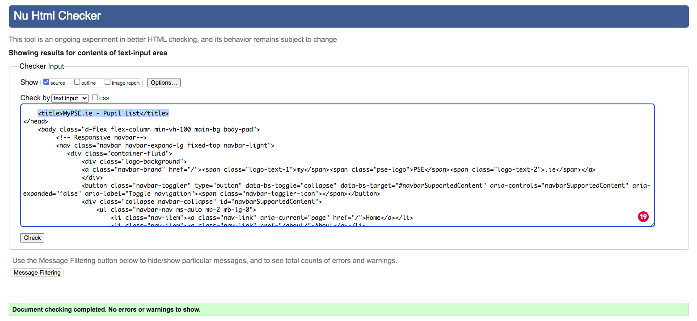

# Testing

## Tests during development

### User Story Tests

I tested each of my user stories by adding acceptance criteria to each card of each of the four sprint boards I created as part of the [AGILE](../docs/AGILE.md) planning process. 

No story could move to the 'done' column of each Kanban board unless all tasks had been completed and the criteria had been met.

 
_User Story Screenshot_ 

 
_Bug Screenshot_ 

All of the user story acceptance criteria can be inspected via the four Sprint boards I have linked to in the [AGILE](../docs/AGILE.md) documentation.

 

## Manual Testing

Each page, feature and link of the application has been tested.
I have used dropdown menus for each page to make the documentation more human readable.

Home Page Testing
 

Each link of the Home Page was tested and was marked 'pass' when the following expected behaviour was produced.

* Login Redirect -- The user is directed to the correct page depending on the users authentication status upon login or when the login links in the homepage cards are clicked.

* Can Access About Page -- The user can access the about page from the home page.

* Can Access Login Page -- The user can access the login page via the nav bar.

* Can Access Logout Page -- The user can access the logout page via the nav bar.

* Card Links -- The user is redirected to the login page if not authenticated or redirected to correct landing page for user type if authenticated when login card link is clicked. The user can access the about page from the about card link.

* Can open footer links -- Footer links open in a new tab.

 

Below is the testing table for the home page.

| Logged in as  | Login Redirect             | Can Access About Page | Can Access Login | Can Access Logout | Can Access Register  | Card Links                   | Can open Footer Links (new tab) |
|---------------|----------------------------|-----------------------|------------------|-------------------|----------------------|------------------------------|---------------------------------|
| Not Logged In | N/A                        | pass                  | yes/pass         | no/pass           | yes/pass             | login-login-about/pass       | yes/pass                        |
| Admin         | home                       | pass                  | no/pass          | yes/pass          | no/pass              | home-home-about/pass         | yes/pass                        |
| School        | Enrolled Pupil List/pass   | pass                  | no/pass          | yes/pass          | no/pass              | redirect-redirect-about/pass | yes/pass                        |
| Pupil         | Pupil Check/pass           | pass                  | no/pass          | yes/pass          | no/pass              | redirect-redirect-about/pass | yes/pass                        |
| Parent        | Passport List/pass         | pass                  | no/pass          | yes/pass          | no/pass              | redirect-redirect-about/pass | yes/pass                        |
| Teacher       | Teacher Passport List/pass | pass                  | no/pass          | yes/pass          | no/pass              | redirect-redirect-about/pass | yes/pass                        |

 

Home page validator testing.

The Home page was passed through the W3C HTML Validator and returned no errors

 
_W3C HTML Validator Testing Screenshot_ 

The Home page was passed through the Jigsaw CSS validator and returned no errors.

 
_W3C Jigsaw CSS Validator Testing Screenshot_

The Home page was passed through the WCAG Color contrast checker and returned no contrast errors.

 
_WCAG Validator Testing Screenshot_

The Home Page was passed through Lighthouse and returned the following performance results:

 
_Desktop Lighthouse Performance Testing Screenshot_

 
_Mobile Lighthouse Performance Testing Screenshot_

In future versions of the app I hope to significantly improve mobile performance.
 

About Page Testing
 

Each link of the About Page was tested and was marked 'pass' when the following expected behaviour was produced.

* Can Access Home Page -- The user can access the home page from the about page.

* Can Access Learn More Page -- The user can access the learn more page from the about page.

* Can Access Login Page -- The user can access the login page via the nav bar.

* Can Access Logout Page -- The user can access the logout page via the nav bar.

* Can Download User Guides -- The user can download any of the user guides from the about page. (opens new tab)

* Can Download Samples -- The user can download any of the sample passports frtom the about page. (opens new tab)

* Can open footer links -- Footer links open in a new tab.

 

Below is the testing table for the about page.

| Logged in as  | Can Access Home Page | Can Access Learn More Page | Can Access Login | Can Access Logout | Can Access Register  | Can Download User Guide (new tab) | Can Download Samples (new tab) | Can Open Footer Links (new tab) |
|---------------|----------------------|----------------------------|------------------|-------------------|----------------------|-----------------------------------|--------------------------------|---------------------------------|
| Not Logged In | Pass                 | pass                       | yes/pass         | no/pass           | yes/pass             | Pupil/Parent/Teacher/School/Pass  | Sample One/SampleTwo/Pass      | yes/pass                        |
| Admin         | Pass                 | pass                       | no/pass          | yes/pass          | no/pass              | Pupil/Parent/Teacher/School/Pass  | Sample One/SampleTwo/Pass      | yes/pass                        |
| School        | Pass                 | pass                       | no/pass          | yes/pass          | no/pass              | Pupil/Parent/Teacher/School/Pass  | Sample One/SampleTwo/Pass      | yes/pass                        |
| Pupil         | Pass                 | pass                       | no/pass          | yes/pass          | no/pass              | Pupil/Parent/Teacher/School/Pass  | Sample One/SampleTwo/Pass      | yes/pass                        |
| Parent        | Pass                 | pass                       | no/pass          | yes/pass          | no/pass              | Pupil/Parent/Teacher/School/Pass  | Sample One/SampleTwo/Pass      | yes/pass                        |
| Teacher       | Pass                 | pass                       | no/pass          | yes/pass          | no/pass              | Pupil/Parent/Teacher/School/Pass  | Sample One/SampleTwo/Pass      | yes/pass                        |

About page validator testing.

The About page was passed through the W3C HTML Validator and returned no errors

 
_W3C HTML Validator Testing Screenshot_ 

The About page was passed through the Jigsaw CSS validator and returned no errors.

 
_W3C Jigsaw CSS Validator Testing Screenshot_

The About page was passed through the WCAG Color contrast checker and returned no contrast errors.

 
_WCAG Validator Testing Screenshot_

The About Page was passed through Lighthouse and returned the following performance results:

 
_Desktop Lighthouse Performance Testing Screenshot_

 
_Mobile Lighthouse Performance Testing Screenshot_

In future versions of the app I hope to significantly improve mobile performance.
 

Login Page Testing
 

Each link of the Login Page was tested and was marked 'pass' when the following expected behaviour was produced. A created user from every user type was logged in succesfully.
 

* Can Access Home Page -- The user can access the home page from the login page.

* Can Access About Page -- The user can access the about page from the login page.

* Can Access Register Page -- The user can access the register page via the nav bar or the signup link.

* Can login as Admin -- Admin user can login

* Can login as School -- School user can login

* Can login as Pupil -- Pupil user can login

* Can login as Parent -- Parent user can login

* Can login as Teacher -- Teacher user can login

* Can open footer links -- Footer links open in a new tab.

 

Below is the testing table for the Login page.

| Logged In As  | Can Access Home Page | Can Access About Page | Can Login As Admin | Can Login As School | Can Login As Pupil  | Can Login As Parent | Can Login As Teacher | Can Access Register (both links) | Can Open Footer Links (new tab) |
|---------------|----------------------|-----------------------|--------------------|---------------------|---------------------|---------------------|----------------------|----------------------------------|---------------------------------|
| Not Logged In | yes/pass             | yes/pass              | yes/pass           | yes/pass            | yes/pass            | yes/pass            | Yes Pass             | Yes/Pass                         | yes/pass                        |

Login page validator testing.

The Login page was passed through the W3C HTML Validator and returned no errors

 
_W3C HTML Validator Testing Screenshot_ 

The Login page was passed through the Jigsaw CSS validator and returned no errors.

 
_W3C Jigsaw CSS Validator Testing Screenshot_

The Login page was passed through the WCAG Color contrast checker and returned no contrast errors.

 
_WCAG Validator Testing Screenshot_

The Login Page was passed through Lighthouse and returned the following performance results:

 
_Desktop Lighthouse Performance Testing Screenshot_

 
_Mobile Lighthouse Performance Testing Screenshot_
 

Logout Page Testing
 

Each link of the Logout Page was tested and was marked 'pass' when the following expected behaviour was produced. A created user from every user type was logged out succesfully.
 

* Can Access Home Page -- The user can access the home page from the logout page.

* Can Access About Page -- The user can access the about page from the logout page.

* Can logout as Admin -- Admin user can logout.

* Can logout as School -- School user can logout.

* Can logout as Pupil -- Pupil user can logout.

* Can logout as Parent -- Parent user can logout.

* Can logout as Teacher -- Teacher user can logout.

* Can Access user list - user can access list page dedicated to their user type.

* Can open footer links -- Footer links open in a new tab.

 

Below is the testing table for the Logout page.

| Logged in as  | Can Logout | Can Access Home Page | Can Access About Page | Can Access User List | Can Open Footer Links (new tab) |
|---------------|------------|----------------------|-----------------------|----------------------|---------------------------------|
| Not Logged In | n/a        | n/a                  | n/a                   | n/a                  | yes/pass                        |
| Admin         | pass       | pass                 | pass                  | no/pass              | yes/pass                        |
| School        | pass       | pass                 | pass                  | yes/pass             | yes/pass                        |
| Pupil         | pass       | pass                 | pass                  | yes/pass             | yes/pass                        |
| Parent        | pass       | pass                 | pass                  | yes/pass             | yes/pass                        |
| Teacher       | pass       | pass                 | pass                  | yes/pass             | yes/pass                        |

 

Logout page validator testing.

The Logout page was passed through the W3C HTML Validator and returned no errors

 
_W3C HTML Validator Testing Screenshot_ 

The Logout page was passed through the Jigsaw CSS validator and returned no errors.

 
_W3C Jigsaw CSS Validator Testing Screenshot_

The Logout page was passed through the WCAG Color contrast checker and returned no contrast errors.

 
_WCAG Validator Testing Screenshot_

The Logout Page was passed through Lighthouse and returned the following performance results:

 
_Desktop Lighthouse Performance Testing Screenshot_

 
_Mobile Lighthouse Performance Testing Screenshot_
 

Registration Page Testing
 

Each link of the Registration Page was tested and was marked 'pass' when the following expected behaviour was produced. A user of every user type was registered succesfully.
 

* Can Access Home Page -- The user can access the home page from the registration page.

* Can Access About Page (both links) -- The user can access the about page from the registration page.

* Can Access Login Page (both links) -- The user can access the login page from the registration page.

* Can register as School -- School user can register.

* Can register as Pupil -- Pupil user can register.

* Can register as Parent -- Parent user can register.

* Can register as Teacher -- Teacher user can register.

* User is redirected on login - user is redirected to list page dedicated to their user type.

* Can open footer links -- Footer links open in a new tab.
| Logged In As  | Can Access Home Page | Can Access About Page (both links) | Can Register As School | Can Register As Pupil  | Can Register As Parent | Can Register As Teacher | Can Access Login (both links) | Can Open Footer Links (new tab) |
|---------------|----------------------|------------------------------------|------------------------|------------------------|------------------------|-------------------------|-------------------------------|---------------------------------|
| Not Logged In | yes/pass             | yes/pass                           | yes/pass               | yes/pass               | yes/pass               | Yes Pass                | Yes/Pass                      | yes/pass                        |

 

Rsgistration page validator testing.

The Registration page was passed through the W3C HTML Validator and returned no errors

 
_W3C HTML Validator Testing Screenshot_ 

The Registration page was passed through the Jigsaw CSS validator and returned no errors.

 
_W3C Jigsaw CSS Validator Testing Screenshot_

The Registration page was passed through the WCAG Color contrast checker and returned no contrast errors.

 
_WCAG Validator Testing Screenshot_

The Registration Page was passed through Lighthouse and returned the following performance results:

 
_Desktop Lighthouse Performance Testing Screenshot_

 
_Mobile Lighthouse Performance Testing Screenshot_
 

404 Error Page Testing
 

Each link of the 404 Error Page Testing was tested and was marked 'pass' when the following expected behaviour was produced.
 

* Can Access Home Page (both links) -- The user can access the home page from the 404 error page

* Can Access About Page  -- The user can access the about page from the 404 error page

* Can Access Login Page (if logged out)  -- The user can access the login page from the 404 error page

* Can Access Logout Page - user can access Logout page from the 404 error page

* Can Access Registration Page - user can access registration page from the 404 error page

* Can Access user list - user can access list page dedicated to their user type.

* Can open footer links -- Footer links open in a new tab.

| User Status | Can Access Home Page (both links) | Can Access About Page | Can Access Login Page (if logged out)  | Can Access Logout Page (if logged in) | Can Access Registration Page (If Logged Out) | Can Access User List (if logged in | Can Open Footer Links (new tab) |
|-------------|-----------------------------------|-----------------------|---------------------------------------|------------------------------------|----------------------------------------------|------------------------------------|---------------------------------|
| Any         | yes/pass                          | yes/pass              | yes/pass                              | yes/pass                           | yes/pass                                     | Yes/Pass                           | yes/pass                        |

 

404 error page validator testing.

The 404 error page was passed through the W3C HTML Validator and returned no errors

 
_W3C HTML Validator Testing Screenshot_ 

The 404 error page was passed through the Jigsaw CSS validator and returned no errors.

 
_W3C Jigsaw CSS Validator Testing Screenshot_

The 404 error page was passed through the WCAG Color contrast checker and returned no contrast errors.

 
_WCAG Validator Testing Screenshot_

The 404 error page was passed through Lighthouse and returned the following performance results:

 
_Desktop Lighthouse Performance Testing Screenshot_

 
_Mobile Lighthouse Performance Testing Screenshot_
 

500 Error Page Testing
 

Each link of the 500 Error Page Testing was tested and was marked 'pass' when the following expected behaviour was produced.
 

* Can Access Home Page (both links) -- The user can access the home page from the 500 error page

* Can Access About Page  -- The user can access the about page from the 500 error page

* Can Access Login Page (if logged out)  -- The user can access the login page from the 500 error page

* Can Access Logout Page - user can access Logout page from the 500 error page

* Can Access Registration Page - user can access registration page from the 500 error page

* Can Access user list - user can access list page dedicated to their user type.

* Can open footer links -- Footer links open in a new tab.

 

| User Status | Can Access Home Page (both links) | Can Access About Page | Can Access Login Page (if logged out)  | Can Access Logout Page (if logged in) | Can Access Registration Page (If Logged Out) | Can Access User List (if logged in | Can Open Footer Links (new tab) |
|-------------|-----------------------------------|-----------------------|---------------------------------------|------------------------------------|----------------------------------------------|------------------------------------|---------------------------------|
| Any         | yes/pass                          | yes/pass              | yes/pass                              | yes/pass                           | yes/pass                                     | Yes/Pass                           | yes/pass                        |

 

500 error page validator testing.

The 500 error page was passed through the W3C HTML Validator and returned no errors

 
_W3C HTML Validator Testing Screenshot_ 

The 500 error page was passed through the Jigsaw CSS validator and returned no errors.

 
_W3C Jigsaw CSS Validator Testing Screenshot_

The 500 error page was passed through the WCAG Color contrast checker and returned no contrast errors.

 
_WCAG Validator Testing Screenshot_

The 500 error page was passed through Lighthouse and returned the following performance results:

 
_Desktop Lighthouse Performance Testing Screenshot_

 
_Mobile Lighthouse Performance Testing Screenshot_
 

Delete Passport Page Testing
 

Each link of the Delete Passport Page was tested and was marked 'pass' when the following expected behaviour was produced.
 

* Can Access Home Page -- The user can access the home page from the Delete Passport page

* Can Access About Page  -- The user can access the about page from the Delete Passport page

* Can Access Logout Page - user can access Logout page from the Delete Passport page

* Can Access user list - user can access list page dedicated to their user type.

* Can Delete Passport - user can delete passport and is returned to list view.

* Can return to passport - user can go back to passport without deleting passport by pressing go back.

* Can open footer links -- Footer links open in a new tab.

 

| User Status  | Can Access Home Page (both links) | Can Access About Page | Can Access Login Page (if logged out)  | Can Access User List (if logged in | Can Delete Passport | Can Return To Passport | Can Open Footer Links (new tab) |
|--------------|-----------------------------------|-----------------------|---------------------------------------|------------------------------------|---------------------|------------------------|---------------------------------|
| Pupil/Parent | yes/pass                          | yes/pass              | yes/pass                              | Yes/Pass                           | yes/pass            | yes/pass               | yes/pass                        |

 

Delete Passport page validator testing.

Because The Delete Passport page cannot be accessed by W3c I passed the template source code through the W3C HTML Validator and it returned an error

 
_W3C HTML Validator Testing Screenshot_ 

I added a hashtag to the empty form attribute.

 
_W3C HTML Validator Testing Screenshot_ 

This resolved the error.

 
_W3C HTML Validator Testing Screenshot_ 

The Delete Passport page was passed through the Jigsaw CSS validator and returned no errors.

 
_W3C Jigsaw CSS Validator Testing Screenshot_

The Delete Passport page was passed through the WCAG Color contrast checker and returned no contrast errors.

 
_WCAG Validator Testing Screenshot_

The Delete Passport page was passed through Lighthouse and returned the following performance results:

 
_Desktop Lighthouse Performance Testing Screenshot_

 
_Mobile Lighthouse Performance Testing Screenshot_

The SEO test score was lower here as the URL is not allowed to be crawled for security purposes.
 

Delete Pupil Record Page Testing
 

Each link of the Delete Pupil Record Page was tested and was marked 'pass' when the following expected behaviour was produced.
 

* Can Access Home Page -- The user can access the home page from the Delete Pupil Record page.

* Can Access About Page  -- The user can access the about page from the Delete Pupil Record page.

* Can Access Logout Page - user can access Logout page from the Delete Pupil Record page.

* Can Access User list - user can access list page dedicated to their user type.

* Can Delete Pupil record - user can delete pupil record and is returned to list view.

* Can return to Pupil Record - user can go back to pupil record without deleting pupil record by pressing go back.

* Can open footer links -- Footer links open in a new tab.

| User Status  | Can Access Home Page (both links) | Can Access About Page | Can Access Login Page (if logged out)  | Can Access User List (if logged in | Can Delete Passport | Can Return To Passport | Can Open Footer Links (new tab) |
|--------------|-----------------------------------|-----------------------|---------------------------------------|------------------------------------|---------------------|------------------------|---------------------------------|
| School Admin | yes/pass                          | yes/pass              | yes/pass                              | Yes/Pass                           | yes/pass            | yes/pass               | yes/pass                        |

 

Delete Pupil Record page. validator testing.

The Delete Pupil Record page source code. was passed through the W3C HTML Validator and returned no errors.

 
_W3C HTML Validator Testing Screenshot_ 

The Delete Pupil Record page was passed through the Jigsaw CSS validator and returned no errors.

 
_W3C Jigsaw CSS Validator Testing Screenshot_

The Delete Pupil Record page was passed through the WCAG Color contrast checker and returned no contrast errors.

 
_WCAG Validator Testing Screenshot_

The Delete Pupil Record page was passed through Lighthouse and returned the following performance results:

 
_Desktop Lighthouse Performance Testing Screenshot_

 
_Mobile Lighthouse Performance Testing Screenshot_

The SEO test score was lower here as the URL is not allowed to be crawled for security purposes.
 

Enrolled Pupil List Page Testing
 

Each link of the Enrolled Pupil List Page was tested and was marked 'pass' when the following expected behaviour was produced.
 

* Can Access Home Page -- The user can access the home page from the Enrolled Pupil List page. 

* Can Access About Page  -- The user can access the about page from the Enrolled Pupil List page.

* Can Access Logout Page - user can access Logout page from the Enrolled Pupil List page.

* Can Access User list - user can access list page dedicated to their user type.

* Can Access Pupil record - user can access pupil record via link.

* Can Download Printable PDF  - user can download form via link.

* Can open footer links -- Footer links open in a new tab.

| Logged in as | Can Access Logout | Can Access Home Page | Can Access About Page | Can Access User List | Can Access Pupil Record | Can Download PDF | Can Open Footer Links (new tab) |
|--------------|-------------------|----------------------|-----------------------|----------------------|-------------------------|------------------|---------------------------------|
| School Admin | yes/pass          | yes/pass             | yes/pass              | yes/pass             | yes/pass                | yes/pass         | yes/pass                        |

 

The Enrolled Pupil List validator testing.

The Enrolled Pupil List page source code. was passed through the W3C HTML Validator and returned no errors.

 
_W3C HTML Validator Testing Screenshot_ 

The Enrolled Pupil List page was passed through the Jigsaw CSS validator and returned no errors.

 
_W3C Jigsaw CSS Validator Testing Screenshot_

The Enrolled Pupil List page was passed through the WCAG Color contrast checker and returned no contrast errors.

 
_WCAG Validator Testing Screenshot_

The Enrolled Pupil List page was passed through Lighthouse and returned the following performance results:

 
_Desktop Lighthouse Performance Testing Screenshot_

The SEO was affected by a poor link decription.

 
_Desktop Lighthouse Performance Testing Screenshot_

I changed the link description to the following.

 
_Desktop Lighthouse Performance Testing Screenshot_

The SEO was optimal after I fixed the error.

 
_Mobile Lighthouse Performance Testing Screenshot_

 

Enrolled Pupil Record Page Testing
 

Each link of the Enrolled Pupil Record Page was tested and was marked 'pass' when the following expected behaviour was produced.
 

* Can Access Home Page -- The user can access the home page from the Enrolled Pupil Record Page. 

* Can Access About Page  -- The user can access the about page from the Enrolled Pupil Record Page.

* Can Access Logout Page - user can access Logout page from the Enrolled Pupil Record Page.

* Can Access User list - user can access list page dedicated to their user type.

* Can Access Edit Pupil record - user can access edit pupil record page via link.

* Can Access Delete Pupil record - user can access delete pupil record page via link.

* Can open footer links -- Footer links open in a new tab.

| Logged in as | Can Access Logout | Can Access Home Page | Can Access About Page | Can Access User List | Can Access Edit Pupil Record | Can Access Delete Record Page | Can Open Footer Links (new tab) |
|--------------|-------------------|----------------------|-----------------------|----------------------|------------------------------|-------------------------------|---------------------------------|
| School Admin | yes/pass          | yes/pass             | yes/pass              | yes/pass             | yes/pass                     | yes/pass                      | yes/pass                        |

 
The Enrolled Pupil Record Page validator testing.

The Enrolled Pupil Record page source code. was passed through the W3C HTML Validator and returned no errors.

 
_W3C HTML Validator Testing Screenshot_ 

The Enrolled Pupil Record page was passed through the Jigsaw CSS validator and returned no errors.

 
_W3C Jigsaw CSS Validator Testing Screenshot_

The Enrolled Pupil Record page was passed through the WCAG Color contrast checker and returned no contrast errors.

 
_WCAG Validator Testing Screenshot_

The Enrolled Pupil Record page was passed through Lighthouse and returned the following performance results:

 
_Desktop Lighthouse Performance Testing Screenshot_

 
_Mobile Lighthouse Performance Testing Screenshot_

 

 

## Bugs

### Bugs found during development

After I imported django allauth I recieved the following error.

 
_ProgrammingError Screenshot_

I searched for and found a solution to this issue on Stack Overflow.

 
_ProgrammingError Stack Overflow Screenshot_ 

 
_ProgrammingError Bugfix Screenshot_ 

Migrating sites fixed the error.

 

The next bug I found during development took the form of a 'NoReverseMatch' error. 

 
_NoReverseMatch Bug Screenshot_ 

This was simply a typo in the Login Redirect setting.

 
_NoReverseMatch Bug Screenshot_ 

I fixed the typo to correct the error.

 

By far the most difficult error I had during development was when attempting to develop the update record view. This is the message that was returned.

 
_AttributeError Screenshot_

This was caused by the incorrect syntax being used in the URL configuration.

I resolved this issue by contacting the Code Institute's tutor support and was given assistance by Ger.

 
_Transcript from Code Institute tutor support_

I was somewhat heartend to hear that this problem was an unusual issue and it took an experienced developer a bit of time to reach a resolution.
Because of the nature and scope of this project, I was less concerned about trying to solve every issue by myself. If anything feel I probably spent too long working on this error before asking for help. It is a trait I will concentrate on as I continue my journey as a junior developer. 

 

Another problem was encountered when, the pupil record template returned this 404 error.
 
_404 Error Screenshot_ 

I examined the code block and it seemed to be because the pupil ID number began with zero and the database was dropping the leading zero.

 
_404 Bug Screenshot_ 

 
_404 Pupil ID begins with zero_

I fixed this bug by re-configuring the fields REGEX validator to only accept digits 1-9 for the first digit of a pupil ID number.

 
_404 Bugfix Screenshot_ 

I then used the Admin panel to remove any instances that began with zero.

 

I recieved this NameError when developing the MVT relationships to access passports.

 
_NameError Passport Bug Screenshot_

This error was caused by a missing module at the top of views.py

 
_NameError Passport Bugfix Screenshot_

I fixed this by importing the passport model at the top of views.py

 

I found and fixed a bug caused by a typo in the passport detail template. A miss-typed field name was the cause of the missing text.

 
_Typo Bug Screenshot_ 

 
_Typo Bugfix Screenshot_ 

 

The next 404 error was trying returned when I tried to access a pupil passport.

 
_404 Passpory Bug Screenshot_ 

This error was caused by a missing curly brace.

 
_404 Passport Bug Screenshot_ 

I fixed this by adding the missing symbol.

 

### JavaScript Testing

I used the console in google development tools to test my custom JavaScript code. I used the console log to return values and data types. I also used alert messages when developing MyPSE.ie's check id functions.

 
_Alert raised to signify JS function is working_ 

A particularly annoying bug was found when I recieved an element not found error in the console.

 
_Using console logs to squash a bug_ 

This was simply down to a rougue space as seen in the image below.

 
_Using console logs to squash a bug_ 

 

### Responsiveness Testing

I physically tested the responsiveness of the application across the following devices.

Macbook Pro 13 (OSX High Sierra): Chrome, Safari and Firefox

 
_Screenshot from Macbook Pro: Chrome_ 

 
_Screenshot from Macbook Pro: Safari_ 

A this was my development machine, I also used it to test responsiveness across a full range of devices using Google's Development tools.

 
_Screenshot from Macbook Pro: Safari_ 

iPhone XR Chrome, Safari

 
_MyPSE on iPhone XR_

Huawei P20 Pro (Android) Chrome, Firefox

 
_Screenshot from on Huawei P20 Pro: Chrome_

iPad Mini 5 Chrome, Safari, Firefox

 
_MyPSE on iPad Mini 5: Firefox_

HP Pavillion Notebook (Windows 10) Chrome, Safari

## Practical Testing

The app was tested for practical use by a School administrator by Susan Hynes, secretary of St Mary's Special School, Drumcar.

During testing, Susan found the following bug.

 
_Bug found by Susan Hynes during practical testing_

The pupil record form would not accept a lowercase letter as the final character of a school roll number.

 
_Bugfix School Roll Number_

This bug was fixed by altering the REGEX validator code for the School Roll no form field to allow lowercase letters.

